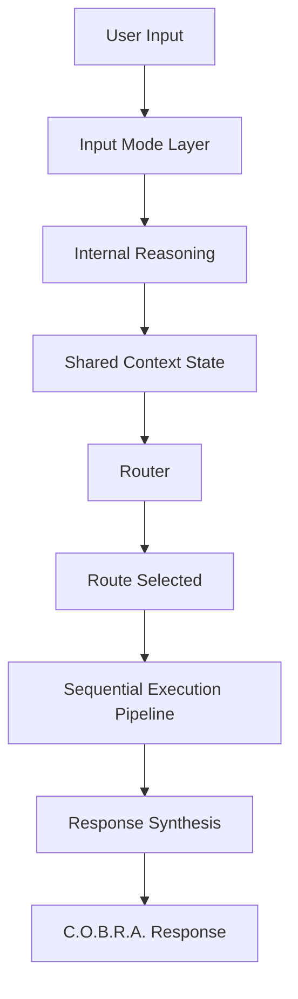

# C.O.B.R.A. Brain — Component Overview

*Cognitive Optimized Brain for Retrieval and Action*

**Status:** Draft  
**Version:** 2.0 (decomposed)  
**Parent sources:** [../brain.md](../brain.md), [../brain-flow.mermaid](../brain-flow.mermaid)  
**Owner:** Damian  

---

## Purpose

The brain is the core reasoning and decision-making component of C.O.B.R.A. It is responsible for:

- Processing input (voice or text)
- Retrieving context
- Reasoning internally before acting
- Routing to the correct execution path
- Ensuring every response reflects the user's personality and privacy requirements

All processing is **local-first**. No personal data leaves the system without explicit user approval.

---

## High-Level Flow

Authoritative diagram: [../brain-flow.mermaid](../brain-flow.mermaid).

---

## Component Index

| Component | Spec | brain.md | brain-flow.mermaid |
|-----------|------|----------|-------------------|
| Input Mode Layer | [input-mode-layer.md](input-mode-layer.md) | §0 | `INPUT`, `A`, `I1`–`I5` |
| Model Layer | [model-layer.md](model-layer.md) | §1 | (cross-cutting) |
| Internal Reasoning | [reasoning.md](reasoning.md) | §2 | `R` |
| Router | [router.md](router.md) | §3.1, 3.3–3.5 | `B`, `C`, `D`, `E`, `F`, `PL` |
| Sequential Execution Pipeline | [sequential-execution-pipeline.md](sequential-execution-pipeline.md) | §3.2 | `PIPELINE`, `P1`–`P6` |
| Verification Pipeline | [verification-pipeline.md](verification-pipeline.md) | §5.4, §6 | `VERIFY`, `V1`–`V10` |
| Memory Architecture | [memory-architecture.md](memory-architecture.md) | §4.1–4.3, 4.5 | `MEMORY`, `M0`, `M1`, `W1`–`W8` |
| Session Summarizer | [session-summarizer.md](session-summarizer.md) | §4.4 | `SUMMARIZE`, `S1`–`S4` |
| Wiki Operations | [wiki-operations.md](wiki-operations.md) | §4.2 (ops, schema, nav) | `WIKIOPS`, `WO1`–`WO3` |
| Personality Model | [personality-model.md](personality-model.md) | §5 | `PERSONALITY`, `PE1`–`PE4` |
| Proactivity Engine | [proactivity-engine.md](proactivity-engine.md) | §7 | `PROACTIVE`, `PR1`–`PR7` |
| Context Awareness | [context-awareness.md](context-awareness.md) | §8 | `CONTEXT`, `CA1`–`CA3` |
| Failure Handling | [failure-handling.md](failure-handling.md) | §9 | `CHECK`, `FAIL`, `FINAL`, `V` |
| Privacy | [privacy.md](privacy.md) | §10, §3.5 | `PRIVACY`, `PR_1`–`PR_4` |

**Implementation sequencing:** [implementation-plan.md](implementation-plan.md)

---

## Cross-Cutting Rules

1. **Local-first memory** — raw logs, wiki, and vector DB stay on device ([memory-architecture.md](memory-architecture.md)).
2. **Think-first** — internal reasoning produces an execution plan ([reasoning.md](reasoning.md)).
3. **Sequential pipeline** — memory → tools → optional verification → personality → synthesis ([sequential-execution-pipeline.md](sequential-execution-pipeline.md)).
4. **Privacy** — external APIs get the topic, never the person ([privacy.md](privacy.md)).
5. **No silent guessing** — router asks for clarification when uncertain ([router.md](router.md)).
6. **Honest failure** — “I don't know, but here's where I'd look” ([failure-handling.md](failure-handling.md)).

---

## Source Conflicts to Resolve at Implementation

| Topic | brain.md | brain-flow.mermaid |
|-------|----------|-------------------|
| Reasoning vs. router order | §2: reasoning after router assigns path, before retrieval | `I5` → `R` → `CONTEXT` → `B` (reasoning before router) |

Both are recorded in [reasoning.md](reasoning.md); implementation must reconcile before build.

---

## Open Items (from brain.md §11)

- [ ] Seed document — to be created collaboratively (structured interview with Claude)
- [ ] Define MCP servers to connect for verification pipeline
- [ ] Define wiki schema document structure and conventions
- [ ] Define confidence threshold for router LLM classification
- [ ] Define what qualifies as a “useful answer” worth auto-filing to wiki
- [ ] Define API timeout thresholds for verification pipeline sources
- [ ] Define context window budget per pipeline step for target local model

Tracked by owner component in each spec and consolidated in [implementation-plan.md](implementation-plan.md).

---

*Decomposed from brain.md and brain-flow.mermaid. Parent spec remains the authoritative source document; these files add implementable component boundaries.*
