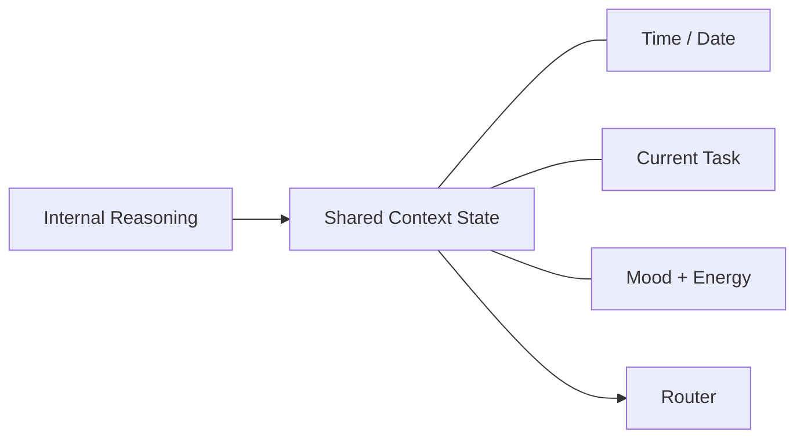

# Context Awareness (Shared Context State)

Read-only shared state consumed by every pipeline step for a single run.

## Source Mapping

| Source | Reference |
|--------|-----------|
| brain.md | Section 8 (Context Awareness), 8.1–8.3 |
| brain-flow.mermaid | subgraph `CONTEXT` (`CA1`–`CA3`) |

## Responsibilities

Package context into a **shared state object** at the start of every pipeline run.

### `CA1` — Time / Date (§8.1)

- Always have current time and date.
- Use for reminders, pattern detection, and episodic memory references.

### `CA2` — Current Task (§8.2)

- User may declare task at session start.
- Do not assume or carry over task from previous sessions.
- If no task declared, wait — do not ask.
- Auto-update mid-session on clear topic shift.
- Explicit user declarations always beat auto-detection.

### `CA3` — Mood + Energy (§8.3)

- Infer from communication patterns; user may declare at session start.
- **Text signals:** message length, complexity, tone.
- **Voice signals:** speech pace and pauses — not transcribed text length.
- Short/clipped → assume busy/stressed → concise, direct responses.
- Long/exploratory → assume relaxed → more conversational responses.
- If unclear, ask once early in session.
- Log and track inferences over time for this user.
- Adjustment is silent; explicit declarations override inference.

## Inputs / Outputs

| Direction | Content |
|-----------|---------|
| **In** | Reasoning output (`R` → `CONTEXT`); user declarations; auto-detection updates (user or C.O.B.R.A. only) |
| **Out** | Read-only shared state → Router and all pipeline steps (`CONTEXT` → `B`, read by `P1`–`P6`) |

## Flow

## Rules and Constraints

- Every pipeline step **reads** shared state; **no step may modify it**.
- Only the user or C.O.B.R.A. auto-detection may update context (outside step execution).

## Open Items

_None specific to this component._

## Cross-References

- [reasoning.md](reasoning.md)
- [router.md](router.md)
- [sequential-execution-pipeline.md](sequential-execution-pipeline.md)
- [proactivity-engine.md](proactivity-engine.md) — pattern and time-based triggers
- [input-mode-layer.md](input-mode-layer.md) — voice mood signals
