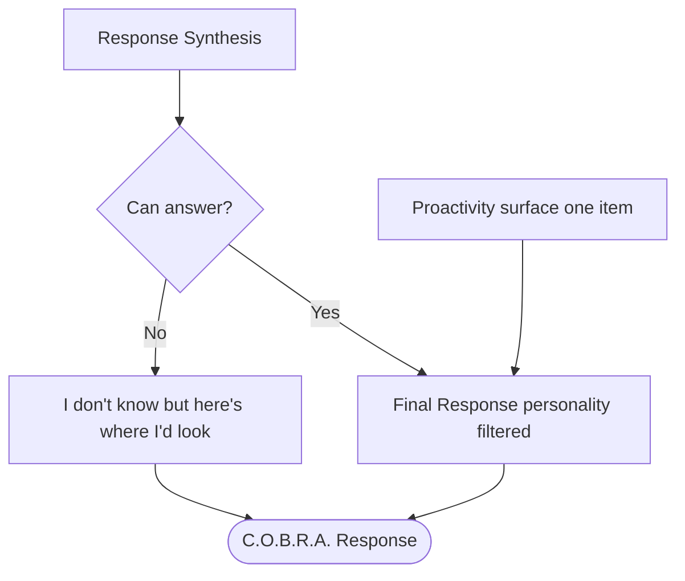

# Failure Handling

Handles cases where C.O.B.R.A. cannot answer after pipeline and verification efforts.

## Source Mapping

| Source | Reference |
|--------|-----------|
| brain.md | Section 9 (Failure Handling); §3.2 notes true fallback is separate branch from synthesis |
| brain-flow.mermaid | `CHECK`, `FAIL`, `FINAL`, `V` (C.O.B.R.A. Response) |

## Responsibilities

After Response Synthesis (`P6` → `CHECK`):

| Branch | Node | Behavior |
|--------|------|----------|
| Can answer | `CHECK` → `FINAL` | Final response, personality filtered in user's voice |
| Cannot answer | `CHECK` → `FAIL` | **“I don't know, but here's where I'd look”** |

Both `FAIL` and `FINAL` → `V` C.O.B.R.A. Response.

When C.O.B.R.A. cannot answer and external verification also fails (brain.md §9):

- Never fabricate an answer to fill the gap.
- Provide actionable next steps for the user to find the answer themselves.

Proactivity may also route to `FINAL` (`PR7` → `FINAL`) — distinct from failure path but same output node family.

## Inputs / Outputs

| Direction | Content |
|-----------|---------|
| **In** | Synthesized pipeline output (`P6`); verification outcomes when applicable |
| **Out** | User-visible `V` response — success (`FINAL`) or honest failure (`FAIL`) |

## Flow

## Rules and Constraints

- No fabricated answers.
- Failure copy must include where to look / actionable next steps.
- True fallback is separate from normal synthesis path (brain.md §3.2).

## Open Items

_None specific to this component._

## Cross-References

- [sequential-execution-pipeline.md](sequential-execution-pipeline.md) — `P6`, `CHECK`
- [verification-pipeline.md](verification-pipeline.md) — when verification fails
- [personality-model.md](personality-model.md) — `FINAL` voice
- [proactivity-engine.md](proactivity-engine.md) — `PR7` → `FINAL`
