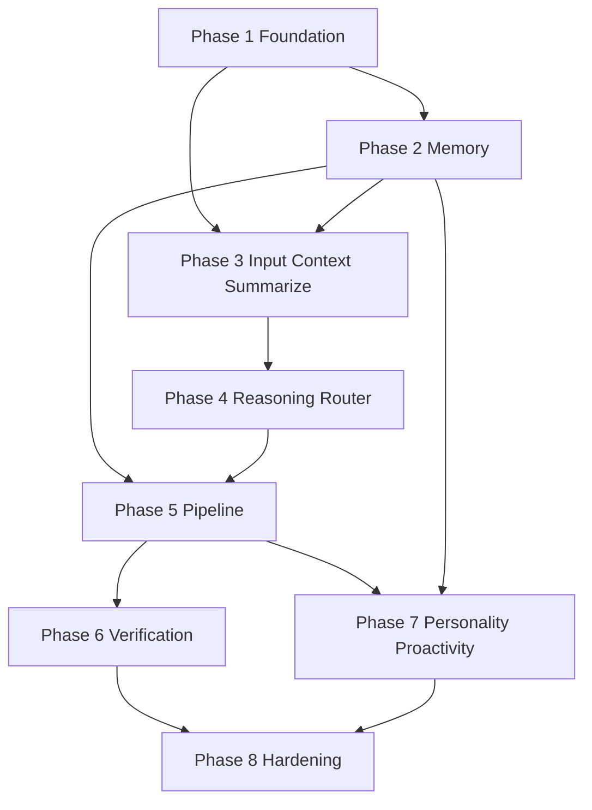

# Brain — Implementation Plan

Phased build order for the C.O.B.R.A. brain component. Each phase maps to specs in this folder. **No implementation begins without user approval** (per parent [../brain.md](../brain.md)).

---

## Blocking Decisions (brain.md §11)

Resolve before or during the phase that needs them:

| Open item | Blocks | Owner spec |
|-----------|--------|------------|
| Wiki schema structure and conventions | Phase 2 wiki, Phase 3 ingest | [wiki-operations.md](wiki-operations.md) |
| “Useful answer” auto-filing criteria | Phase 2 query, Phase 3 ingest | [wiki-operations.md](wiki-operations.md) |
| Router LLM confidence threshold | Phase 4 router | [router.md](router.md) |
| MCP servers for verification | Phase 6 verification | [verification-pipeline.md](verification-pipeline.md) |
| API timeout thresholds per verification source | Phase 6 verification | [verification-pipeline.md](verification-pipeline.md) |
| Context window budget per pipeline step | Phase 1 model, Phase 5 pipeline | [model-layer.md](model-layer.md), [sequential-execution-pipeline.md](sequential-execution-pipeline.md) |
| Seed document (personality) | Phase 7 personality | [personality-model.md](personality-model.md) |
| Reasoning vs. router ordering conflict | Phase 3–4 integration | [reasoning.md](reasoning.md), [brain-overview.md](brain-overview.md) |

---

## Phase 1 — Foundation

**Goal:** Runnable local inference and privacy gate.

| Deliverable | Spec |
|-------------|------|
| LM Studio OpenAI-compatible client; config-only model selection; unreachable/loading → notify user, wait | [model-layer.md](model-layer.md) |
| Privacy screening module (topic-only, approval flow, deny = no send) | [privacy.md](privacy.md) |
| Full reset hook (logs + wiki + personality) | [privacy.md](privacy.md) |

**Exit criteria:** Model calls succeed/fail visibly; outbound requests blocked or sanitized per privacy spec.

---

## Phase 2 — Memory Storage

**Goal:** Persistent local memory without pipeline integration.

| Deliverable | Spec |
|-------------|------|
| Immutable raw conversation log writer/reader | [memory-architecture.md](memory-architecture.md) |
| Wiki file layout (`W1`–`W8`), `index.md`, `log.md` | [memory-architecture.md](memory-architecture.md), [wiki-operations.md](wiki-operations.md) |
| ChromaDB (or equivalent) embed on wiki change | [memory-architecture.md](memory-architecture.md) |
| Wiki ingest / query / lint operations (manual or scheduled triggers OK for dev) | [wiki-operations.md](wiki-operations.md) |

**Exit criteria:** Write conversation → ingest summary → query via index + vector; lint job runs.

**Blocked by:** wiki schema, useful-answer criteria (for production-quality ingest/query).

---

## Phase 3 — Input, Context, Summarization

**Goal:** Normalize input and close the session loop.

| Deliverable | Spec |
|-------------|------|
| Voice path: Whisper, confidence loop, clean text | [input-mode-layer.md](input-mode-layer.md) |
| Text path: direct to clean text | [input-mode-layer.md](input-mode-layer.md) |
| Shared context object (time, task, mood); read-only for pipeline steps | [context-awareness.md](context-awareness.md) |
| Session summarizer: topic split, segment + meta-summary, store | [session-summarizer.md](session-summarizer.md) |
| Wire summarizer → wiki ingest | [session-summarizer.md](session-summarizer.md), [wiki-operations.md](wiki-operations.md) |

**Exit criteria:** Mixed voice/text session produces meta-summary and wiki updates.

---

## Phase 4 — Reasoning and Router

**Goal:** Classify intent and produce execution plan.

| Deliverable | Spec |
|-------------|------|
| Internal reasoning (silent plan: retrieve, tools, correction, framing) | [reasoning.md](reasoning.md) |
| Rule + LLM hybrid router; clarification UI; pattern memory | [router.md](router.md) |
| Reconcile reasoning/router order per [brain-overview.md](brain-overview.md) conflict table | [brain-overview.md](brain-overview.md) |

**Exit criteria:** Message classified or clarification returned; plan attached to pipeline run.

**Blocked by:** router confidence threshold.

---

## Phase 5 — Sequential Execution Pipeline

**Goal:** End-to-end answer path without external verification APIs.

| Deliverable | Spec |
|-------------|------|
| `P1` Memory retrieval (index + pages + vector) | [sequential-execution-pipeline.md](sequential-execution-pipeline.md) |
| `P2` Tool execution with privacy enforcement | [sequential-execution-pipeline.md](sequential-execution-pipeline.md), [privacy.md](privacy.md) |
| `P3` Correction gate (auto + manual triggers) | [sequential-execution-pipeline.md](sequential-execution-pipeline.md) |
| `P5` Personality mirror | [personality-model.md](personality-model.md) |
| `P6` Response synthesis | [sequential-execution-pipeline.md](sequential-execution-pipeline.md) |
| `CHECK` / `FAIL` / `FINAL` / `V` failure and success paths | [failure-handling.md](failure-handling.md) |

**Exit criteria:** Routed message → synthesized response or honest failure; no verification APIs required yet (correction branch stubbed or skipped).

**Blocked by:** context window budget per step.

---

## Phase 6 — Verification Pipeline

**Goal:** Fact-check path with wiki persistence.

| Deliverable | Spec |
|-------------|------|
| Sanitized topic-only query builder | [verification-pipeline.md](verification-pipeline.md) |
| Sequential sources: Claude → Copilot → MCP; timeouts | [verification-pipeline.md](verification-pipeline.md) |
| 2+ agree / conflict / suppress branches; wiki Verified Facts + Non-findings | [verification-pipeline.md](verification-pipeline.md), [memory-architecture.md](memory-architecture.md) |
| Wire `P4` ↔ `VERIFY` ↔ `P5` | [sequential-execution-pipeline.md](sequential-execution-pipeline.md) |

**Exit criteria:** Manual fact-check and auto-detected claim follow full `V1`–`V10` flow.

**Blocked by:** MCP list, API timeouts.

---

## Phase 7 — Personality and Proactivity

**Goal:** Voice consistency and event-driven proactive surfacing.

| Deliverable | Spec |
|-------------|------|
| Seed doc + interviews + behavioral logging → You page | [personality-model.md](personality-model.md) |
| Summarizer → personality updates | [personality-model.md](personality-model.md), [session-summarizer.md](session-summarizer.md) |
| Session buffer + wiki/vector monitors + priority queue | [proactivity-engine.md](proactivity-engine.md) |
| Conversation-complete event from `P6`; silence gating; one item at a time | [proactivity-engine.md](proactivity-engine.md) |

**Exit criteria:** Responses match You page voice; proactive item surfaces only after event + silence (or explicit ask).

**Blocked by:** seed document.

---

## Phase 8 — Integration Hardening

**Goal:** Production readiness per parent spec.

| Deliverable | Spec |
|-------------|------|
| End-to-end test: voice + text → response → summarize → ingest → proactive | [brain-overview.md](brain-overview.md) |
| Daily lint job | [wiki-operations.md](wiki-operations.md) |
| Privacy audit on all outbound paths | [privacy.md](privacy.md) |
| Document resolved reasoning/router ordering | [reasoning.md](reasoning.md) |

**Exit criteria:** Full [../brain-flow.mermaid](../brain-flow.mermaid) path exercised; all §11 open items closed or explicitly deferred with user approval.

---

## Dependency Graph

---

## Spec File Checklist

- [input-mode-layer.md](input-mode-layer.md)
- [model-layer.md](model-layer.md)
- [reasoning.md](reasoning.md)
- [router.md](router.md)
- [context-awareness.md](context-awareness.md)
- [memory-architecture.md](memory-architecture.md)
- [session-summarizer.md](session-summarizer.md)
- [wiki-operations.md](wiki-operations.md)
- [sequential-execution-pipeline.md](sequential-execution-pipeline.md)
- [verification-pipeline.md](verification-pipeline.md)
- [personality-model.md](personality-model.md)
- [proactivity-engine.md](proactivity-engine.md)
- [failure-handling.md](failure-handling.md)
- [privacy.md](privacy.md)
- [brain-overview.md](brain-overview.md)
- [implementation-plan.md](implementation-plan.md)
