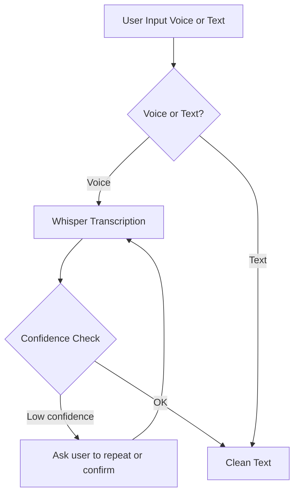

# Input Mode Layer

Normalizes voice and text input into clean text before downstream brain processing.

## Source Mapping

| Source | Reference |
|--------|-----------|
| brain.md | Section 0 (Input Mode Layer), 0.1–0.3 |
| brain-flow.mermaid | `A`, subgraph `INPUT` (`I1`–`I5`) |

## Responsibilities

- Support voice and text input simultaneously; user may switch freely within a session.
- **Voice (`I1` → `I2` → `I3`):** Transcribe audio via Whisper before entering the pipeline.
- **Confidence (`I3`):** If transcription confidence is low, ask the user to repeat or confirm (`I4`) before proceeding; loop back to transcription (`I4` → `I2`).
- **Text (`I1` → `I5`):** Text enters with no pre-processing step.
- **Output (`I5`):** Produce clean text for all paths.
- Never store audio — only the transcription is kept.
- Handle transcription errors and artifacts gracefully before the router.
- For voice mood signals: use speech patterns (pace, pauses) — not transcribed text length (feeds Context Awareness).

## Inputs / Outputs

| Direction | Content |
|-----------|---------|
| **In** | User input: voice (audio) or text |
| **Out** | Clean text (`I5`) → Internal Reasoning (`R`) |

## Flow

## Rules and Constraints

- Both modes produce clean text that enters downstream processing identically.
- Voice and text may be mixed freely within the same session.
- Audio is never stored.

## Open Items

_None specific to this component._

## Cross-References

- [reasoning.md](reasoning.md) — receives clean text from `I5`
- [context-awareness.md](context-awareness.md) — voice mood signals (pace, pauses)
- [brain-overview.md](brain-overview.md)
