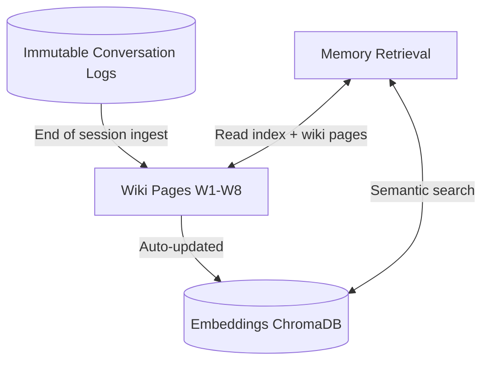

# Memory Architecture

Three local layers — raw logs, wiki, vector DB — that store and supply knowledge.

## Source Mapping

| Source | Reference |
|--------|-----------|
| brain.md | Section 4.1–4.3, 4.5 (Memory Architecture, layers, retrieval) |
| brain-flow.mermaid | subgraph `MEMORY` (`RAW`/`M0`, `WIKI`/`W1`–`W8`, `VECTOR`/`M1`); `P1` read edges to `WIKI` and `M1` |

## Responsibilities

### Layer 1 — Raw Logs (`M0`, subgraph `RAW`)

- Immutable record of all conversations.
- Read-only for C.O.B.R.A. — never modified.
- Source of truth for summarization and wiki ingest.
- Kept forever — no automatic expiry.
- Never passed raw to external APIs.

### Layer 2 — Wiki (`W1`–`W8`, subgraph `WIKI`)

- LLM-maintained persistent markdown wiki; knowledge compiled at ingestion — not re-derived every query.
- **Pages:** You (`W1`), Preferences (`W2`), Verified Facts (`W3`), Topics (`W4`), Decisions (`W5`), Non-findings (`W6`), plus navigation `index.md` (`W7`), `log.md` (`W8`).
- **Preferences:** Timestamped evolution trail for conflicts — never overwrite (“used to prefer X, now prefers Y”).
- **Non-findings:** 30-day TTL per entry; after expiry topic treated as unchecked and re-queried if it arises again.
- **Flow:** `M0` → end-of-session ingest → `WIKI`; wiki operations detailed in [wiki-operations.md](wiki-operations.md).

### Layer 3 — Vector DB (`M1`, subgraph `VECTOR`)

- Embeddings of wiki pages in local vector DB (e.g. ChromaDB).
- Fast semantic retrieval during pipeline execution.
- Auto-updated when wiki pages are created or modified (`WIKI` → `M1`).
- Fully local — nothing stored externally.

### Memory Retrieval (§4.5, pipeline step `P1`)

- First step in every pipeline execution after reasoning (per brain.md §4.5).
- Read `index.md`, identify relevant pages, retrieve content into context.
- Use vector search when index lookup alone is insufficient (`P1` ↔ `WIKI`, `P1` ↔ `M1`).

## Inputs / Outputs

| Direction | Content |
|-----------|---------|
| **In** | Raw conversation logs; session summaries for ingest; wiki page writes from Wiki Operations |
| **Out** | Retrieved wiki content + vector hits to `P1`; embeddings in `M1` |

## Flow

## Rules and Constraints

- All memory data fully local.
- Raw logs immutable and never sent to external APIs.
- Verified Facts populated by Verification Pipeline; Non-findings with 30-day TTL.

## Open Items

- [ ] Define wiki schema document structure and conventions (brain.md §11) — see [wiki-operations.md](wiki-operations.md)

## Cross-References

- [wiki-operations.md](wiki-operations.md) — ingest, query, lint
- [session-summarizer.md](session-summarizer.md) — meta-summary drives ingest
- [sequential-execution-pipeline.md](sequential-execution-pipeline.md) — `P1`
- [verification-pipeline.md](verification-pipeline.md) — `V9`, `V10` wiki writes
- [personality-model.md](personality-model.md) — You page
- [proactivity-engine.md](proactivity-engine.md) — `PR2` monitors wiki + vector
