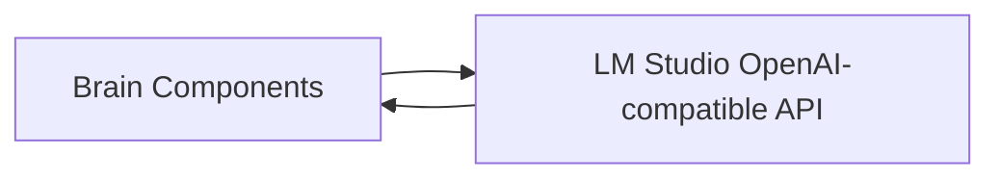

# Model Layer

Provides model-agnostic LLM access for all brain components that require inference.

## Source Mapping

| Source | Reference |
|--------|-----------|
| brain.md | Section 1 (Model Layer) |
| brain-flow.mermaid | _No dedicated node — used by Router, Reasoning, Pipeline steps, Verification, Wiki maintenance, Summarizer, etc._ |

## Responsibilities

- Remain **model-agnostic**: underlying LLM swappable without code changes.
- Route all model calls through LM Studio’s OpenAI-compatible REST API.
- Load model selection and configuration from environment/config only — never hardcoded.
- On failure (LM Studio unreachable or model loading): notify the user immediately and wait — do not silently fail.

## Inputs / Outputs

| Direction | Content |
|-----------|---------|
| **In** | Inference requests from brain components (classification, reasoning, synthesis, summarization, wiki maintenance, etc.) |
| **Out** | Model completions / errors surfaced to calling component |

## Flow

## Rules and Constraints

- Configuration via environment/config only — never hardcoded model IDs or endpoints in component code.
- Unreachable or loading model → user notification + wait; no silent failure.

## Open Items

- [ ] Define context window budget per pipeline step for target local model (brain.md §11)

## Cross-References

- [router.md](router.md) — LLM classification
- [reasoning.md](reasoning.md) — internal reasoning
- [sequential-execution-pipeline.md](sequential-execution-pipeline.md) — synthesis and tool-related inference
- [verification-pipeline.md](verification-pipeline.md) — external APIs are separate; local model may assist query construction
- [session-summarizer.md](session-summarizer.md)
- [wiki-operations.md](wiki-operations.md)
- [implementation-plan.md](implementation-plan.md)
