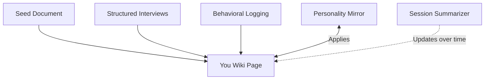

# Personality Model

Captures and applies the user's voice across all contexts via the wiki You page.

## Source Mapping

| Source | Reference |
|--------|-----------|
| brain.md | Section 5 (Personality), 5.1–5.4 |
| brain-flow.mermaid | subgraph `PERSONALITY` (`PE1`–`PE4`); `P5` ↔ `PERSONALITY`; `SUMMARIZE` -.-> `PERSONALITY` |

## Responsibilities

### Goal (§5.1)

- Mimic the user's personality exactly in professional, casual, and personal contexts.
- Model lives in wiki **You** page (`PE4`); updated continuously.

### Data Collection (`PE1`–`PE3`)

1. **`PE1` Seed document** — communication style, values, decision patterns, humor, hard preferences; created collaboratively with Claude before first use.
2. **`PE2` Structured interviews** — ongoing questions on tone, beliefs, pet peeves, behavior across contexts.
3. **`PE3` Behavioral logging** — every interaction is training data; You page improves as patterns are observed.

All three feed **`PE4` You Wiki Page** (all contexts, evolving).

### Dimensions Captured (§5.3)

- Communication style and tone
- Decision-making patterns and tradeoff weighting
- Core values and beliefs
- Pet peeves and hard nos
- Context-specific behavior (professional / casual / close relationships)
- Humor style
- How the user handles being wrong

### Pipeline Application

- **Personality Mirror (`P5`):** Applies personality filter before Response Synthesis output is finalized (`P5` ↔ `PERSONALITY`).
- **Session Summarizer:** Updates personality over time (`SUMMARIZE` -.-> `PE4`).

### Agreement and Correction (§5.4)

- Agree with user by default; correction rules enforced via [verification-pipeline.md](verification-pipeline.md).

## Inputs / Outputs

| Direction | Content |
|-----------|---------|
| **In** | Seed doc, interviews, behavioral logs, summarizer updates |
| **Out** | Personality-filtered phrasing to `P5`; updated `PE4` wiki content |

## Flow

## Rules and Constraints

- You page is the single living personality store.
- Corrections require verification pipeline rules — never hallucinated corrections.

## Open Items

- [ ] Seed document — to be created collaboratively (structured interview with Claude) (brain.md §11)

## Cross-References

- [sequential-execution-pipeline.md](sequential-execution-pipeline.md) — `P5`
- [memory-architecture.md](memory-architecture.md) — `W1` You page
- [verification-pipeline.md](verification-pipeline.md) — §5.4 correction rules
- [session-summarizer.md](session-summarizer.md)
- [failure-handling.md](failure-handling.md) — `FINAL` personality-filtered response
