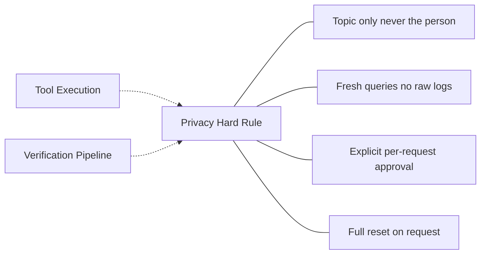

# Privacy (Hard Rule)

Master privacy constraints enforced across every brain component.

## Source Mapping

| Source | Reference |
|--------|-----------|
| brain.md | Section 10 (Privacy — Master Rule); Section 3.5 (Router data privacy) |
| brain-flow.mermaid | subgraph `PRIVACY` (`PR_1`–`PR_4`); `P2` -.-> `PRIVACY`; `VERIFY` -.-> `PRIVACY` |

## Responsibilities

> **External APIs get the topic, never the person.**

Applies to every brain component without exception.

### `PR_1` — Topic-only outbound

- External APIs receive topic only — never the person.

### `PR_2` — Fresh queries

- Queries constructed from scratch for outbound calls.
- Raw logs never sent externally.

### `PR_3` — Explicit approval

- Personal data requires explicit **per-request** user approval.
- Every outbound request screened before sending.
- If sharing personal context externally is required: stop, explain what and why, wait — **denied = nothing sent, no exceptions** (brain.md §3.5).

### `PR_4` — Full reset

- User may trigger full reset anytime — wipes behavioral logs, wiki, and personality model.

### Internal use (brain.md §10)

- Behavioral logs used in full internally for personalization.
- Raw log content never passed to external APIs.

### Enforcement points (diagram)

- **Tool execution (`P2`):** enforced by privacy (`P2` -.-> `PRIVACY`).
- **Verification (`VERIFY`):** enforced by privacy (`VERIFY` -.-> `PRIVACY`).
- **Router (§3.5):** screens outbound requests; sanitization rules as in [router.md](router.md).

## Inputs / Outputs

| Direction | Content |
|-----------|---------|
| **In** | Outbound request payloads from Tool Execution, Verification, Router |
| **Out** | Sanitized topic-only queries; approval prompts; block on deny |

## Flow

## Rules and Constraints

- Example (router §3.5): “How does late night screen time affect sleep?” ✅ | “Damian codes late at night and has sleep issues…” ❌
- Verification: sanitized topic-only queries; raw logs never bundled (see [verification-pipeline.md](verification-pipeline.md)).
- Raw logs immutable and never sent externally ([memory-architecture.md](memory-architecture.md)).

## Open Items

_None beyond global open items — MCP and timeout definitions live under verification._

## Cross-References

- [router.md](router.md) — §3.5 screening
- [verification-pipeline.md](verification-pipeline.md)
- [sequential-execution-pipeline.md](sequential-execution-pipeline.md) — `P2`
- [memory-architecture.md](memory-architecture.md) — raw logs
- [personality-model.md](personality-model.md) — reset wipes personality
- [brain-overview.md](brain-overview.md)
