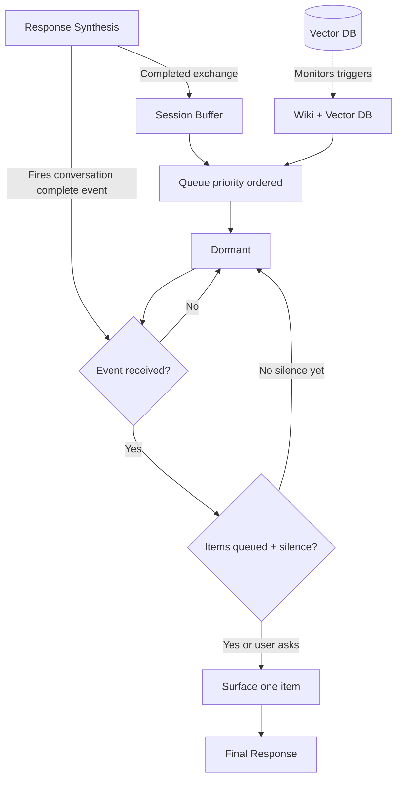

# Proactivity Engine

Event-driven engine that queues observations and surfaces one item at the right moment.

## Source Mapping

| Source | Reference |
|--------|-----------|
| brain.md | Section 7 (Proactivity), 7.1–7.3 |
| brain-flow.mermaid | subgraph `PROACTIVE` (`PR1`–`PR7`); `P6` → `PR5`, `PR1`; `M1` -.-> `PR2`; `PR7` → `FINAL` |

## Responsibilities

C.O.B.R.A. is observant but patient — notices, queues, speaks only at the right moment.

### Triggers (§7.1) — queue when detecting

- **Pattern** over time (“You've asked about X three times this week”)
- **Unfinished intention** (“You said last month you wanted to do Y — you haven't yet”)
- **Contradiction** between now vs. before
- **Time-based gap** (“It's been 3 weeks since you reviewed Z”)

### Input Sources

| Node | Source | Role |
|------|--------|------|
| `PR1` | Session buffer | Lightweight buffer of completed exchanges in current session; intra-session patterns; cleared at session end after summarization |
| `PR2` | Wiki + vector DB | Cross-session patterns; `M1` monitors for triggers |

`PR1` & `PR2` → `PR3` priority-ordered queue → `PR4` dormant.

### Surfacing (§7.3, `PR4`–`PR7`)

- **Event-driven:** dormant until **conversation complete** event from Response Synthesis (`P6` → `PR5`).
- `PR4` → on event → `PR5`{conversation complete event received?}
  - No → return to `PR4` dormant
  - Yes → `PR6`{items queued + silence?}
    - Yes or user asks → `PR7` surface one item, most important first → `FINAL`
    - No silence yet → `PR4` dormant, wait for next event
- Also surface when user explicitly asks (“anything I should know?”).
- **Never** interrupt mid-conversation; **never** poll continuously.
- One item at a time.

## Inputs / Outputs

| Direction | Content |
|-----------|---------|
| **In** | Completed exchanges (`P6` → `PR1`); conversation complete event (`P6` → `PR5`); wiki/vector signals (`M1` -.-> `PR2`); explicit user ask |
| **Out** | Single proactive message to final response path (`PR7` → `FINAL`) |

## Flow

## Rules and Constraints

- Event-driven only — no continuous polling.
- Silence required before surfacing (unless user explicitly asks).

## Open Items

_None specific to this component._

## Cross-References

- [sequential-execution-pipeline.md](sequential-execution-pipeline.md) — `P6` events
- [session-summarizer.md](session-summarizer.md) — buffer cleared after summarization
- [memory-architecture.md](memory-architecture.md) — `M1`, wiki
- [failure-handling.md](failure-handling.md) — `FINAL` path
- [context-awareness.md](context-awareness.md) — time/date for gap detection
