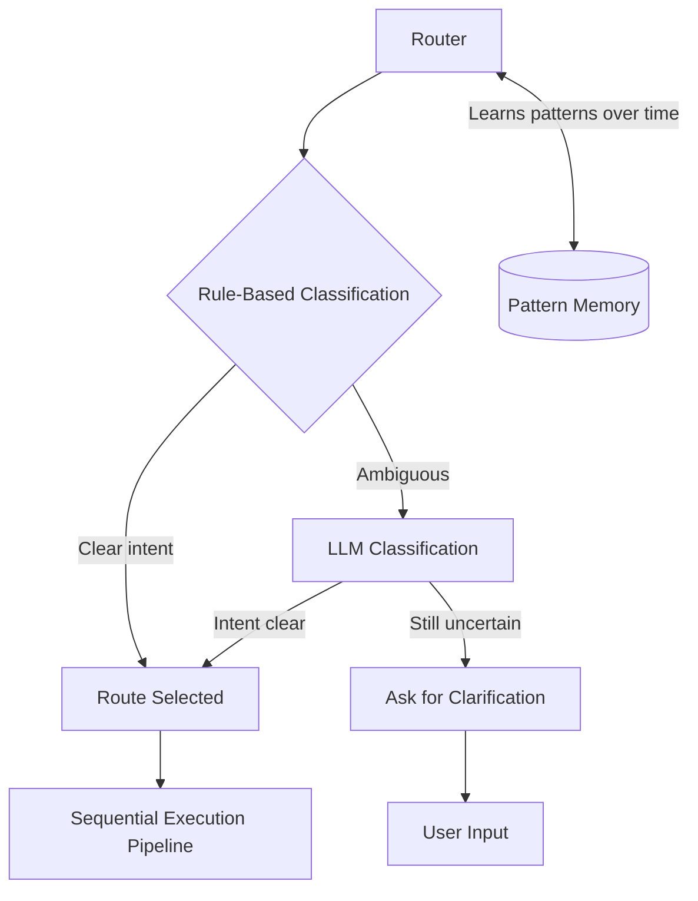

# Router

Classifies intent and selects the execution path for every message after input normalization.

## Source Mapping

| Source | Reference |
|--------|-----------|
| brain.md | Section 3 (Router), 3.1–3.5 (classification, uncertainty, pattern learning; §3.2 step list lives in sequential-execution-pipeline) |
| brain-flow.mermaid | `B`, `C`, `D`, `E`, `F`, `PL` |

## Responsibilities

- First processing layer for every message after Input Mode Layer (per brain.md); in diagram, follows Shared Context State (`CONTEXT` → `B`).
- **Rule-based classification (`C`):** Obvious cases — greetings, simple factual questions, small talk → `D` Route Selected.
- **LLM classification (`E`):** Ambiguous cases when rules insufficient.
- **Uncertainty (`F`):** If still uncertain → ask for clarification (2–3 options + custom input) → loop to `A` User Input; never silently guess.
- **Pattern learning (`PL`):** Learn classification patterns over time; repeated query types improve routing; pattern memory persists across sessions (`B` ↔ `PL`).
- Screen outbound requests per privacy rules (see [privacy.md](privacy.md)); stop and request approval when personal context would leave the system.

## Inputs / Outputs

| Direction | Content |
|-----------|---------|
| **In** | Shared Context State + message after reasoning path |
| **Out** | `D` Route Selected → Sequential Execution Pipeline; or clarification UI via `F` → `A` |

## Flow

## Rules and Constraints

- Hybrid strategy: speed for clear cases, accuracy for complex ones.
- Clarification: 2–3 options plus custom response input.
- **No personal data leaves the system without explicit user approval** (§3.5).
- Every outbound request screened before sending.
- If sharing personal context externally is required: stop, explain what and why, wait for approval — **denied = nothing sent, no exceptions**.
- **Outbound sanitization:** External APIs receive topic only — never the person; fresh topic-only queries from scratch; raw logs never bundled.
- Example: “How does late night screen time affect sleep?” ✅ | “Damian codes late at night and has sleep issues…” ❌

## Open Items

- [ ] Define confidence threshold for router LLM classification (brain.md §11)

## Cross-References

- [sequential-execution-pipeline.md](sequential-execution-pipeline.md) — execution after `D`
- [privacy.md](privacy.md) — master privacy rules and enforcement
- [model-layer.md](model-layer.md) — LLM classification
- [reasoning.md](reasoning.md)
- [context-awareness.md](context-awareness.md)
