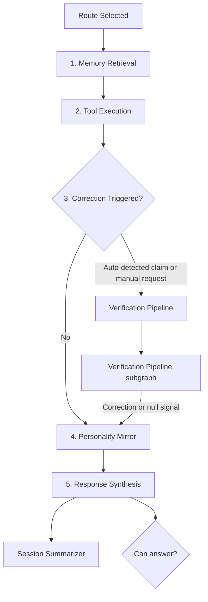

# Sequential Execution Pipeline

Runs five ordered steps after routing — thoroughness over speed.

## Source Mapping

| Source | Reference |
|--------|-----------|
| brain.md | Section 3.2 (Priority Order — Sequential) |
| brain-flow.mermaid | subgraph `PIPELINE` (`P1`–`P6`, including `P4` entry to Verification) |

## Responsibilities

Execution is **sequential** — each step completes before the next begins.

| Step | Node | Responsibility |
|------|------|----------------|
| 1 | `P1` | **Memory retrieval** — read `index.md`, fetch wiki pages, vector search when needed |
| 2 | `P2` | **Tool execution** — fetch external data if memory alone cannot answer |
| 3 | `P3`/`P4` | **Correction branch** — if auto-detected verifiable claim or manual fact-check → Verification Pipeline (`P4` → `VERIFY`); else skip to `P5` |
| 4 | `P5` | **Personality mirror** — filter through user voice (applies [personality-model.md](personality-model.md)) |
| 5 | `P6` | **Response synthesis** — assemble final answer from all pipeline outputs; runs on every path |

After `P6`:

- Session Summarizer (`P6` → `SUMMARIZE`)
- Proactivity: fires **conversation complete** event (`P6` → `PR5`); feeds session buffer (`P6` → `PR1`)
- Failure branch: `P6` → `CHECK` (see [failure-handling.md](failure-handling.md))

True fallback (failure handling) is a **separate branch** from synthesis (brain.md §3.2).

## Inputs / Outputs

| Direction | Content |
|-----------|---------|
| **In** | Route Selected (`D` → `PIPELINE`); shared context; reasoning plan |
| **Out** | Synthesized response path → `CHECK` / `FINAL`; side effects to summarizer, proactivity, memory, verification |

## Flow

## Rules and Constraints

- Memory retrieval is first pipeline step after reasoning (brain.md §4.5).
- Verification only when correcting user — not on every message.
- Personality mirror on every response path before synthesis output is finalized.
- Tool execution (`P2`) subject to [privacy.md](privacy.md) enforcement.

## Open Items

- [ ] Define context window budget per pipeline step for target local model (brain.md §11)

## Cross-References

- [memory-architecture.md](memory-architecture.md) — `P1`
- [verification-pipeline.md](verification-pipeline.md) — `P4`, `VERIFY`
- [personality-model.md](personality-model.md) — `P5`
- [privacy.md](privacy.md) — `P2`
- [session-summarizer.md](session-summarizer.md)
- [proactivity-engine.md](proactivity-engine.md)
- [failure-handling.md](failure-handling.md)
- [router.md](router.md)
