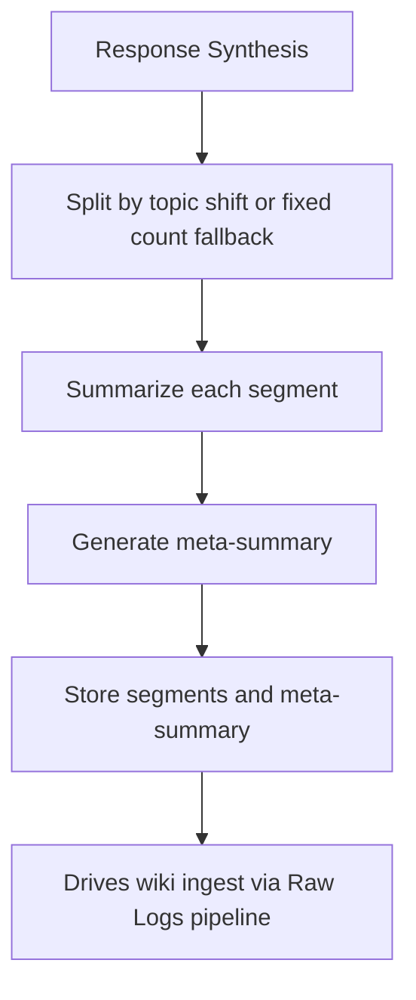

# Session Summarizer

End-of-session chunked summarization that feeds wiki ingest and personality updates.

## Source Mapping

| Source | Reference |
|--------|-----------|
| brain.md | Section 4.4 (Summarization Strategy) |
| brain-flow.mermaid | subgraph `SUMMARIZE` (`S1`–`S4`); `P6` → `SUMMARIZE` → `M0`; `SUMMARIZE` -.-> `PERSONALITY` |

## Responsibilities

- Run after Response Synthesis (`P6` → `SUMMARIZE`).
- **`S1`:** Split session by topic shift first; fixed exchange count as fallback if no topic shift detected.
- **`S2`:** Summarize each segment independently.
- **`S3`:** Generate meta-summary from all segment summaries.
- **`S4`:** Store segment summaries and meta-summary.
- Meta-summary drives wiki ingest for that session (`SUMMARIZE` → `M0` ingest path).
- Updates Personality Model over time (`SUMMARIZE` -.-> `PE4` You Wiki Page).

## Inputs / Outputs

| Direction | Content |
|-----------|---------|
| **In** | Completed session raw logs (`M0`); trigger from `P6` |
| **Out** | Stored segment + meta summaries; input to wiki ingest; personality wiki updates |

## Flow

## Rules and Constraints

- Topic-shift split preferred; fixed exchange count only as fallback.
- Both segment summaries and meta-summary must be stored.
- Session buffer (Proactivity Engine) cleared at session end after summarization (brain.md §7.2).

## Open Items

_None specific to this component._

## Cross-References

- [memory-architecture.md](memory-architecture.md) — `M0`, ingest
- [wiki-operations.md](wiki-operations.md) — ingest uses meta-summary
- [sequential-execution-pipeline.md](sequential-execution-pipeline.md) — `P6` trigger
- [personality-model.md](personality-model.md)
- [proactivity-engine.md](proactivity-engine.md) — session buffer lifecycle
