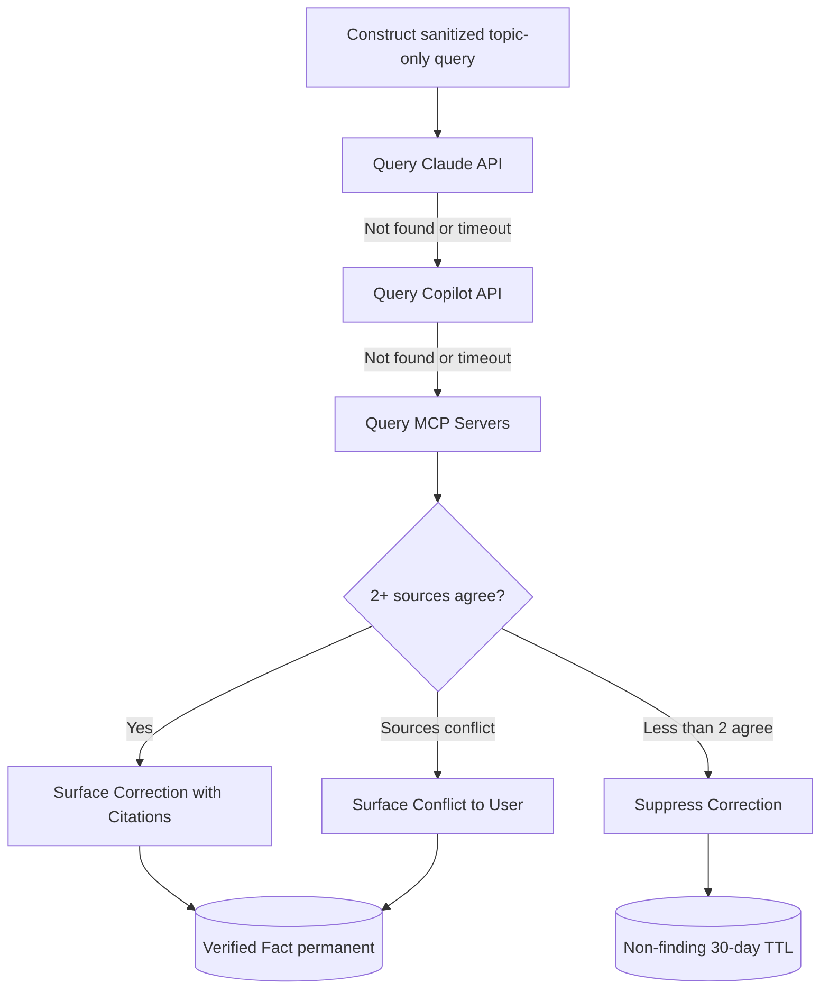

# Verification Pipeline

Fact-checks verifiable claims before correcting the user; writes outcomes to wiki.

## Source Mapping

| Source | Reference |
|--------|-----------|
| brain.md | Section 6 (Verification Pipeline), Section 5.4 (Agreement and Correction Rules) |
| brain-flow.mermaid | subgraph `VERIFY` (`V1`–`V10`); `P4` → `VERIFY` → `P5` |

## Responsibilities

### Trigger (brain.md §5.4, diagram `P3`)

- Internal reasoning identifies a statement as a verifiable factual claim (auto-detection), or
- User explicitly requests a fact check (manual trigger).

### Flow (`V1`–`V10`)

| Step | Node | Action |
|------|------|--------|
| 1 | `V1` | Construct sanitized, topic-only query — no personal context |
| 2 | `V2` | Query Claude API |
| 3 | `V3` | If not found or timeout → Query Copilot API |
| 4 | `V4` | If not found or timeout → Query MCP Servers |
| 5 | `V5` | Evaluate: 2+ sources agree? |
| Yes | `V6` | Surface correction with citations → `V9` store Verified Fact in wiki (permanent) |
| Conflict | `V7` | Surface conflict to user — user decides → `V9` |
| &lt;2 agree | `V8` | Suppress correction, stay silent → `V10` store Non-finding (30-day TTL) |

Returns correction or null signal to Personality Mirror (`VERIFY` → `P5`).

### Correction Rules (brain.md §5.4)

- C.O.B.R.A. **agrees with the user by default**.
- Correct user **only when** ≥2 independent sources agree.
- Sources conflict → surface both sides; user decides.
- Fewer than 2 agree → suppress correction regardless of confidence.
- Hallucinated corrections never acceptable.
- Verified facts → wiki Verified Facts page.

### Source Timeout (§6.2)

- Each external API call has a defined timeout.
- Timeout → “not found” for that source; continue to next source.
- User not notified of individual timeouts unless all sources fail.

### Query Sanitization (§6.3)

- All external queries sanitized per privacy hard rule.
- Raw log content never bundled; fresh topic-only queries from scratch.

## Inputs / Outputs

| Direction | Content |
|-----------|---------|
| **In** | Trigger from `P3`/`P4`; potential correction from reasoning |
| **Out** | Correction/conflict/null to `P5`; wiki writes `V9`/`V10` |

## Flow

## Rules and Constraints

- Minimum 2 independent agreeing sources required to issue correction.
- Enforced by [privacy.md](privacy.md) (`VERIFY` -.-> `PRIVACY`).

## Open Items

- [ ] Define MCP servers to connect for verification pipeline (brain.md §11)
- [ ] Define API timeout thresholds for verification pipeline sources (brain.md §11)

## Cross-References

- [sequential-execution-pipeline.md](sequential-execution-pipeline.md) — `P3`, `P4`
- [personality-model.md](personality-model.md) — agreement defaults
- [memory-architecture.md](memory-architecture.md) — `W3`, `W6`
- [privacy.md](privacy.md)
- [failure-handling.md](failure-handling.md) — when verification also fails
