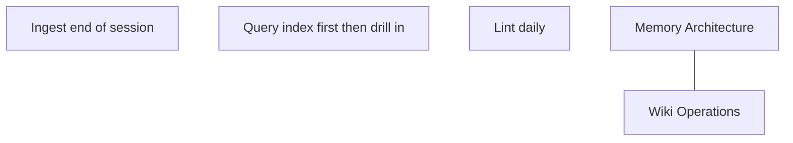

# Wiki Operations

Ingest, query, and lint operations over the LLM-maintained wiki.

## Source Mapping

| Source | Reference |
|--------|-----------|
| brain.md | Section 4.2 (wiki pages, operations, schema, navigation files) |
| brain-flow.mermaid | subgraph `WIKIOPS` (`WO1`–`WO3`); `MEMORY` --- `WIKIOPS` |

## Responsibilities

### `WO1` — Ingest

- Runs automatically at end of each session.
- Reads session summary and updates all relevant wiki pages.
- A single session may touch multiple pages.

### `WO2` — Query

- Read `index.md` first to locate relevant pages, then drill into them.
- Useful answers and analyses from conversation are automatically filed as new wiki pages — not lost in chat history.

### `WO3` — Lint

- Runs daily.
- Health-check wiki: flag contradictions between pages, catch stale claims, identify orphaned pages, surface gaps worth investigating.

### Wiki Schema (brain.md §4.2)

- Schema document defines page formats, naming conventions, cross-referencing rules, and what qualifies as a “useful answer” worth filing.
- Schema may evolve; C.O.B.R.A. may suggest improvements; **user approves all schema changes**.

### Navigation Files

- **`index.md` (`W7`):** Full catalog of wiki pages with one-line summaries, by category.
- **`log.md` (`W8`):** Chronological append-only record of every ingest, query, and lint pass.

## Inputs / Outputs

| Direction | Content |
|-----------|---------|
| **In** | Session meta-summary (ingest); query requests from `P1`; daily lint schedule |
| **Out** | Updated wiki pages (`W1`–`W6`); updated `index.md` / `log.md`; vector re-embed triggers |

## Flow

## Rules and Constraints

- Knowledge integrated at ingestion time — not re-derived on every query.
- Preferences: evolution trail, never blind overwrite.
- Non-findings: 30-day TTL (see [memory-architecture.md](memory-architecture.md)).

## Open Items

- [ ] Define wiki schema document structure and conventions (brain.md §11)
- [ ] Define what qualifies as a “useful answer” worth auto-filing to wiki (brain.md §11)

## Cross-References

- [memory-architecture.md](memory-architecture.md) — wiki layers and pages
- [session-summarizer.md](session-summarizer.md) — ingest input
- [verification-pipeline.md](verification-pipeline.md) — Verified Facts / Non-findings writes
- [personality-model.md](personality-model.md) — You page
