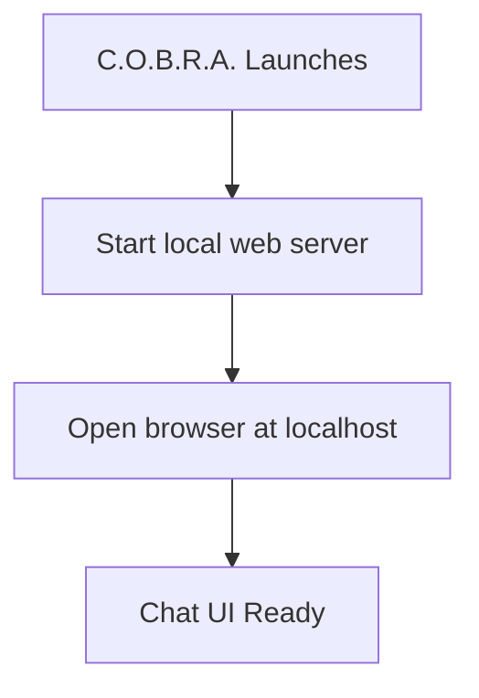

# Application Type

Local offline web application lifecycle tied to C.O.B.R.A. start/stop.

## Source Mapping

| Source | Reference |
|--------|-----------|
| chat-ui.md | Section 1 (Application Type) |
| chat-ui-flow.mermaid | `A` → `B` → `C` → `D` |

## Responsibilities

- **Local web app** — served by a local web server running on the user's machine (`B`).
- Accessed via browser at **`http://localhost:[port]`** (default port defined in config).
- **No internet connection required** — fully offline capable.
- **Starts automatically** when C.O.B.R.A. launches (`A` → `B`).
- **Stops** when C.O.B.R.A. stops.

Startup flow:

1. `A` — C.O.B.R.A. Launches
2. `B` — Start local web server (localhost port)
3. `C` — Open browser at localhost
4. `D` — Chat UI Ready (three-panel layout)

## Inputs / Outputs

| Direction | Content |
|-----------|---------|
| **In** | C.O.B.R.A. process start/stop; port from config |
| **Out** | Running local HTTP server; browser session |

## Flow

## Rules and Constraints

- Server implementation per [technology-stack.md](technology-stack.md).
- Default port is undefined (open item).

## Open Items

- [ ] Define default localhost port
- [ ] Define behavior when browser tab is closed — does C.O.B.R.A. continue running in background?

## Cross-References

- [technology-stack.md](technology-stack.md)
- [chat-ui-overview.md](chat-ui-overview.md)
- [specs/configuration/config-file-structure.md](../configuration/config-file-structure.md)
