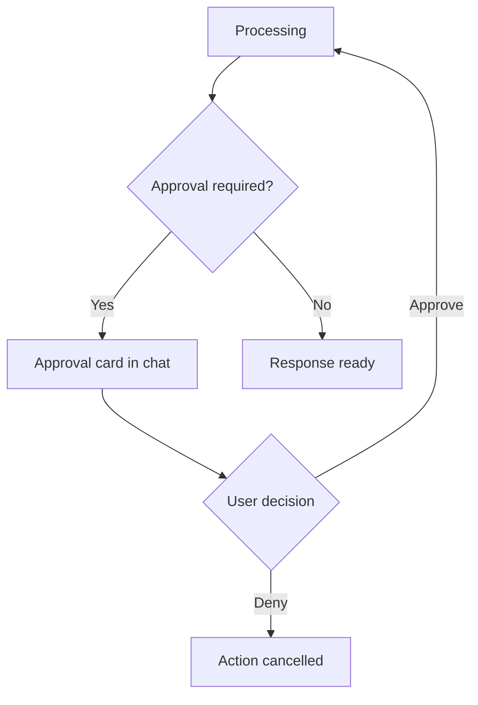

# Approval Prompts

Inline approval cards for tools, MCP calls, and data sharing.

## Source Mapping

| Source | Reference |
|--------|-----------|
| chat-ui.md | Section 7 (Approval Prompts) |
| chat-ui-flow.mermaid | `AP`, `APR`, `APD`, `DEN`; `CH3` |

## Responsibilities

When C.O.B.R.A. requires user approval (tool action, MCP call, data sharing):

- An **approval card** appears inline in the chat panel (`APR`, `CH3`).
- Card shows: **what** C.O.B.R.A. wants to do, **why**, and **what data** will be involved.
- Two buttons: **Approve** and **Deny** (`APD`).
- C.O.B.R.A. **waits** — does not proceed until the user responds.
- **Approve** → resume processing (`H`).
- **Deny** → action cancelled (`DEN`).

Aligns with:

- [specs/tools/approval-model.md](../tools/approval-model.md)
- [specs/mcp-server-layer/approval-model.md](../mcp-server-layer/approval-model.md)

## Inputs / Outputs

| Direction | Content |
|-----------|---------|
| **In** | Approval request payload from backend |
| **Out** | User approve/deny decision |

## Flow

## Rules and Constraints

- Blocking — no timeout auto-approve.
- Sanitized data preview for MCP (topic only).

## Open Items

_None specific to this component._

## Cross-References

- [chat-panel.md](chat-panel.md)
- [specs/tools/approval-model.md](../tools/approval-model.md)
- [specs/mcp-server-layer/approval-model.md](../mcp-server-layer/approval-model.md)
