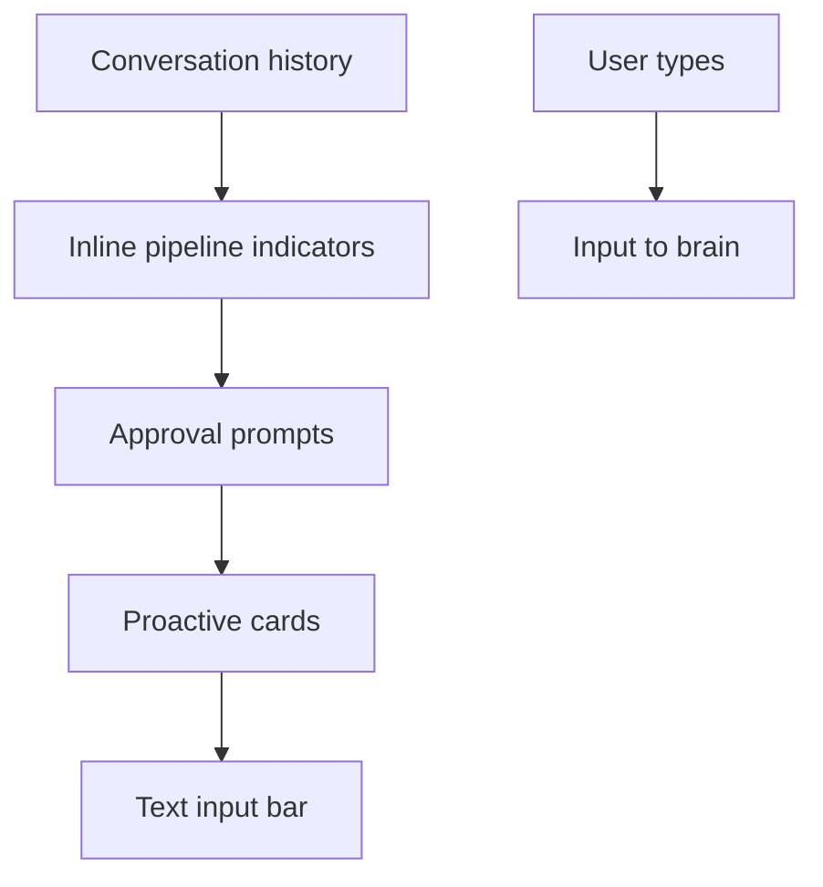

# Chat Panel

Left panel: conversation history, inline indicators, approvals, proactive cards, and text input.

## Source Mapping

| Source | Reference |
|--------|-----------|
| chat-ui.md | Section 2.1 (Chat Panel), §5 (Voice and Text Coexistence) |
| chat-ui-flow.mermaid | `CHAT` `CH1`–`CH5`; `RT`; `PRS`; `G` |

## Responsibilities

### Chat panel (§2.1)

- Displays **full conversation history** — all exchanges in the current session (`CH1`).
- Each message shows: **sender label** (You / C.O.B.R.A.), **timestamp**, **message content**.
- C.O.B.R.A. responses display **voice and text simultaneously** during playback ([specs/voice/voice-output.md](../voice/voice-output.md) `O4` → `CH1`).
- **Pipeline step indicators** appear inline below each C.O.B.R.A. response while processing (`CH2` — see [pipeline-indicators.md](pipeline-indicators.md)).
- **Approval prompts** appear inline when sign-off required (`CH3` — [approval-prompts.md](approval-prompts.md)).
- **Proactive items** surface as a highlighted card between exchanges (`CH4`, `PRS`).
- **Text input bar** at bottom (`CH5`, `G`).

### Voice and text coexistence (§5)

- Text input bar is **always visible** at the bottom of the chat panel.
- Voice and text can be used **freely within the same session**.
- When C.O.B.R.A. responds via voice, text appears in the chat panel **simultaneously**.
- Voice indicator in top bar reflects state regardless of input mode ([top-bar.md](top-bar.md)).

## Inputs / Outputs

| Direction | Content |
|-----------|---------|
| **In** | Messages, pipeline events, approval requests, proactive items |
| **Out** | User text input (`G` → `H`); approve/deny actions |

## Flow

## Rules and Constraints

- Read/write for conversation display; wiki remains read-only in center panel.

## Open Items

- [ ] Define whether panels are resizable by the user

## Cross-References

- [pipeline-indicators.md](pipeline-indicators.md)
- [approval-prompts.md](approval-prompts.md)
- [top-bar.md](top-bar.md)
- [specs/voice/voice-output.md](../voice/voice-output.md)
