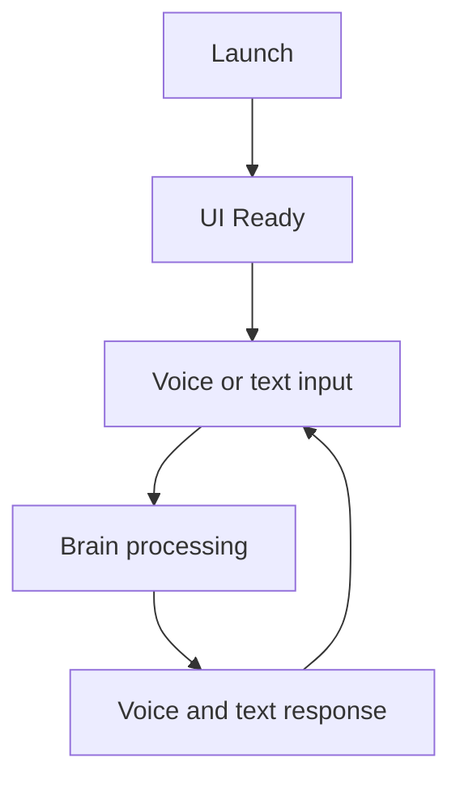

# C.O.B.R.A. Chat UI — Component Overview

*Cognitive Optimized Brain for Retrieval and Action*

**Status:** Draft  
**Version:** 1.0 (decomposed)  
**Parent sources:** [../chat-ui.md](../chat-ui.md), [../chat-ui-flow.mermaid](../chat-ui-flow.mermaid)  
**Owner:** Damian  

---

## Purpose

The Chat UI is the primary visual interface for C.O.B.R.A. It is a **local web application** served on the user's machine — no internet required.

The UI provides:

- Three-panel dark-mode layout (chat, wiki, status)
- Real-time pipeline activity
- Full-text search across all sessions
- Always-visible voice state

---

## Layout — Three Panel

From parent [../chat-ui.md](../chat-ui.md) §2:

```
┌─────────────────────────────────────────────────────────┐
│  C.O.B.R.A.   [Voice Indicator]   [Profile]   [Search] │  ← Top bar
├──────────────────┬──────────────────┬────────────────────┤
│                  │                  │                    │
│  CHAT PANEL      │  WIKI BROWSER    │  STATUS PANEL      │
│  (left)          │  (center)        │  (right)           │
│                  │                  │                    │
│  Conversation    │  Wiki pages      │  Pipeline step     │
│  history         │  index.md        │  MCP servers       │
│  Input bar       │  Page viewer     │  Proactive queue   │
│                  │                  │                    │
├──────────────────┴──────────────────┴────────────────────┤
│  Text input bar                          [Send]          │  ← Bottom bar
└─────────────────────────────────────────────────────────┘
```

---

## High-Level Flow

Authoritative diagram: [../chat-ui-flow.mermaid](../chat-ui-flow.mermaid).



---

## Component Index

| Component | Spec | chat-ui.md | chat-ui-flow.mermaid |
|-----------|------|------------|----------------------|
| Application Type | [application-type.md](application-type.md) | §1 | `A`–`D` |
| Chat Panel | [chat-panel.md](chat-panel.md) | §2.1, §5 | `CHAT` `CH1`–`CH5` |
| Wiki Browser Panel | [wiki-browser-panel.md](wiki-browser-panel.md) | §2.2 | `WIKI` `WK1`–`WK5` |
| Status Panel | [status-panel.md](status-panel.md) | §2.3 | `STATUS` `ST1`–`ST4` |
| Top Bar | [top-bar.md](top-bar.md) | §3 | `TOPBAR`, `VOICE_IND` |
| Search | [search.md](search.md) | §4 | `SEARCH` `SR1`–`SR4` |
| Pipeline Indicators | [pipeline-indicators.md](pipeline-indicators.md) | §6 | `PIPELINE` `P1`–`P6` |
| Approval Prompts | [approval-prompts.md](approval-prompts.md) | §7 | `AP`, `APR`, `APD`, `DEN` |
| Theme | [theme.md](theme.md) | §8 | Styling only |
| Technology Stack | [technology-stack.md](technology-stack.md) | §9 | `WS` |

**Implementation sequencing:** [implementation-plan.md](implementation-plan.md)

---

## Cross-Cutting Rules

1. **Local offline SPA** — no internet required ([application-type.md](application-type.md)).
2. **WebSocket realtime** — pipeline, MCP, proactive ([technology-stack.md](technology-stack.md)).
3. **Dark mode only** ([theme.md](theme.md)).
4. **Voice + text in chat** — simultaneous display ([chat-panel.md](chat-panel.md)).
5. **Approve before risky actions** — inline cards ([approval-prompts.md](approval-prompts.md)).
6. **Wiki read-only in UI** ([wiki-browser-panel.md](wiki-browser-panel.md)).

---

## Open Items (from chat-ui.md)

- [ ] Define default localhost port
- [ ] Define whether panels are resizable by the user
- [ ] Define behavior when browser tab is closed — does C.O.B.R.A. continue running in background?
- [ ] Define whether search indexes are built on startup or on demand
- [ ] Define markdown rendering library for wiki panel

Tracked in owner specs and [implementation-plan.md](implementation-plan.md).

---

*Decomposed from chat-ui.md and chat-ui-flow.mermaid. Parent spec remains authoritative; these files add implementable component boundaries.*
