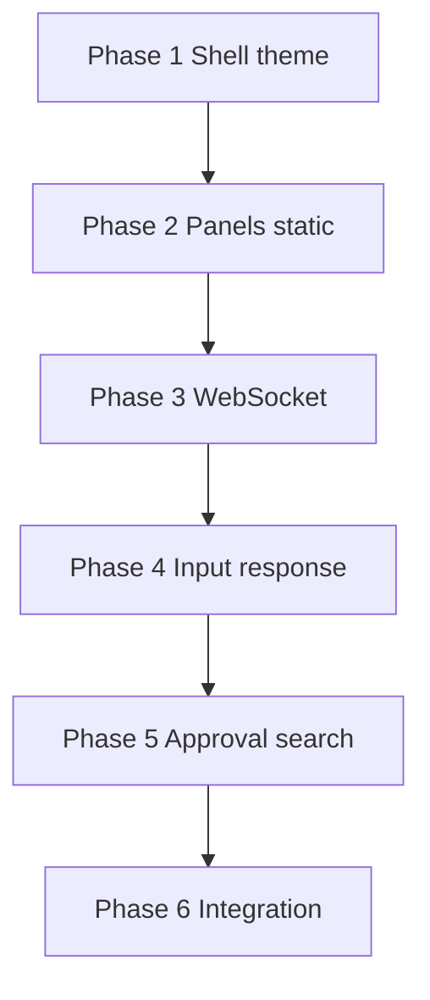

# Chat UI — Implementation Plan

Phased build order for the C.O.B.R.A. Chat UI component. Each phase maps to specs in this folder. **No implementation begins without user approval** (per parent [../chat-ui.md](../chat-ui.md)).

---

## Blocking Decisions (chat-ui.md Open Items)

| Open item | Blocks | Owner spec |
|-----------|--------|------------|
| Default localhost port | Phase 1 app shell | [application-type.md](application-type.md), [technology-stack.md](technology-stack.md) |
| Resizable panels | Phase 2 layout | [chat-ui-overview.md](chat-ui-overview.md), panel specs |
| Browser tab closed behavior | Phase 1 lifecycle | [application-type.md](application-type.md) |
| Search index build timing | Phase 5 search | [search.md](search.md) |
| Markdown rendering library | Phase 2 wiki panel | [wiki-browser-panel.md](wiki-browser-panel.md), [technology-stack.md](technology-stack.md) |

---

## Phase 1 — App Shell and Theme

**Goal:** Local server, static SPA, dark theme.

| Deliverable | Spec |
|-------------|------|
| `A`–`D` startup | [application-type.md](application-type.md) |
| FastAPI/Flask + SPA | [technology-stack.md](technology-stack.md) |
| Dark-only CSS | [theme.md](theme.md) |

**Exit criteria:** Browser opens to three-panel shell on C.O.B.R.A. launch.

**Blocked by:** default port; tab-close behavior.

---

## Phase 2 — Three Panels (Static)

**Goal:** Layout with placeholder content.

| Deliverable | Spec |
|-------------|------|
| ASCII layout structure | [chat-ui-overview.md](chat-ui-overview.md) |
| Chat history + input | [chat-panel.md](chat-panel.md) |
| Wiki index + viewer | [wiki-browser-panel.md](wiki-browser-panel.md) |
| Status sections layout | [status-panel.md](status-panel.md) |
| Top bar + voice indicator UI | [top-bar.md](top-bar.md) |

**Exit criteria:** All three panels render; wiki shows index.md.

**Blocked by:** markdown library (wiki rendering).

---

## Phase 3 — WebSocket Realtime

**Goal:** Live pipeline, MCP, and proactive updates.

| Deliverable | Spec |
|-------------|------|
| `WS1` ↔ `WS2` connection | [technology-stack.md](technology-stack.md) |
| Status panel live data | [status-panel.md](status-panel.md) |
| Pipeline labels | [pipeline-indicators.md](pipeline-indicators.md) |

**Exit criteria:** Status panel updates without page refresh.

---

## Phase 4 — Input and Response

**Goal:** Text and voice paths into brain; dual output display.

| Deliverable | Spec |
|-------------|------|
| `E` voice / `G` text → `H` | [chat-panel.md](chat-panel.md) |
| `RV` + `RT` response delivery | [chat-panel.md](chat-panel.md), [top-bar.md](top-bar.md) |
| Voice indicator states | [top-bar.md](top-bar.md), [specs/voice/voice-output.md](../voice/voice-output.md) |

**Exit criteria:** Text send works; voice responses show text + indicator.

---

## Phase 5 — Approval and Search

**Goal:** Inline governance and history search.

| Deliverable | Spec |
|-------------|------|
| `APR`/`APD`/`DEN` cards | [approval-prompts.md](approval-prompts.md) |
| `SEARCH` overlay | [search.md](search.md) |
| Proactive `PRS` cards | [chat-panel.md](chat-panel.md) |

**Exit criteria:** Approve/deny blocks brain; search jumps to exchange.

**Blocked by:** search index build timing.

---

## Phase 6 — Integration Hardening

**Goal:** End-to-end UI with brain, tools, MCP, voice.

| Deliverable | Spec |
|-------------|------|
| MCP list in status | [specs/mcp-server-layer/live-registry.md](../mcp-server-layer/live-registry.md) |
| Full [../chat-ui-flow.mermaid](../chat-ui-flow.mermaid) | [chat-ui-overview.md](chat-ui-overview.md) |

**Exit criteria:** All open items closed or explicitly deferred with user approval.

---

## Dependency Graph

---

## Spec File Checklist

- [application-type.md](application-type.md)
- [chat-panel.md](chat-panel.md)
- [wiki-browser-panel.md](wiki-browser-panel.md)
- [status-panel.md](status-panel.md)
- [top-bar.md](top-bar.md)
- [search.md](search.md)
- [pipeline-indicators.md](pipeline-indicators.md)
- [approval-prompts.md](approval-prompts.md)
- [theme.md](theme.md)
- [technology-stack.md](technology-stack.md)
- [chat-ui-overview.md](chat-ui-overview.md)
- [implementation-plan.md](implementation-plan.md)
