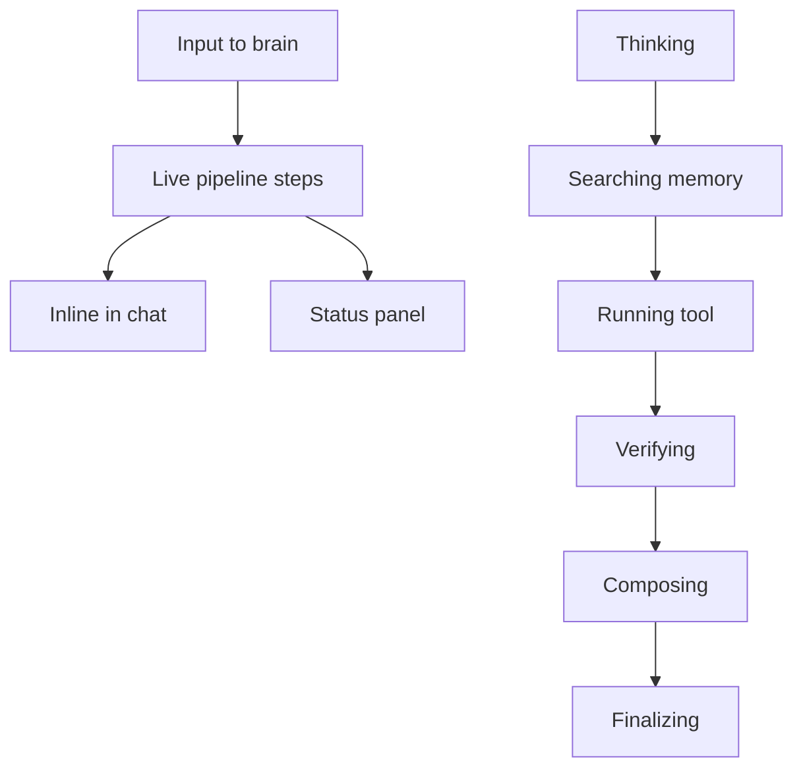

# Pipeline Indicators

Live processing step labels in status panel and inline in chat.

## Source Mapping

| Source | Reference |
|--------|-----------|
| chat-ui.md | Section 6 (Pipeline Step Indicators) |
| chat-ui-flow.mermaid | `PIPELINE` `P1`–`P6`; `CH2`; `PIPELINE` → `STATUS` |

## Responsibilities

When C.O.B.R.A. is processing, the **status panel** and an **inline indicator in the chat** show the active step:

| Step | Label shown |
|---|---|
| Internal Reasoning | Thinking... |
| Memory Retrieval | Searching memory... |
| Tool Execution | Running tool: [tool name] |
| Verification Pipeline | Verifying claim... |
| Personality Mirror | Composing response... |
| Response Synthesis | Finalizing... |

Mermaid pipeline sequence: `P1` → `P2` → `P3` → `P4` → `P5` → `P6`.

Additional behavior:

- Indicators **disappear** when the response is delivered.
- If a step takes longer than expected, a **subtle elapsed time counter** appears.

Updates delivered via WebSocket ([technology-stack.md](technology-stack.md)) to `CH2` and [status-panel.md](status-panel.md) `ST1`.

## Inputs / Outputs

| Direction | Content |
|-----------|---------|
| **In** | Brain pipeline step events |
| **Out** | UI labels in chat and status panel |

## Flow

## Rules and Constraints

- Tool name interpolated in Tool Execution label.
- Aligns with brain sequential/verification pipelines.

## Open Items

_None specific to this component._

## Cross-References

- [status-panel.md](status-panel.md)
- [chat-panel.md](chat-panel.md)
- [technology-stack.md](technology-stack.md)
- [specs/brain/sequential-execution-pipeline.md](../brain/sequential-execution-pipeline.md)
