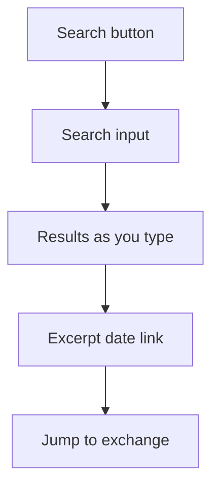

# Search

Full-text local search overlay across all conversation history.

## Source Mapping

| Source | Reference |
|--------|-----------|
| chat-ui.md | Section 4 (Search) |
| chat-ui-flow.mermaid | `SEARCH` `SR1`–`SR4`; triggered from `TB4` |

## Responsibilities

- **Full-text search** across all sessions and all conversation history.
- Search **overlay** opens over the three-panel layout (`TB4` → `SEARCH`).
- Results show: **matched text excerpt**, **session date**, and a **link to jump** to that exchange (`SR3`, `SR4`).
- Search is **local** — no external service used.
- Results **update as you type** (`SR2`).

Mermaid flow:

- `SR1` Full-text search input
- `SR2` Results update as you type
- `SR3` Result shows excerpt, date, session link
- `SR4` Click result to jump to exchange

## Inputs / Outputs

| Direction | Content |
|-----------|---------|
| **In** | Local conversation index / raw logs |
| **Out** | Scroll/highlight target exchange in chat panel |

## Flow

## Rules and Constraints

- No network calls for search.

## Open Items

- [ ] Define whether search indexes are built on startup or on demand

## Cross-References

- [top-bar.md](top-bar.md)
- [chat-panel.md](chat-panel.md)
- [specs/brain/memory-architecture.md](../brain/memory-architecture.md)
