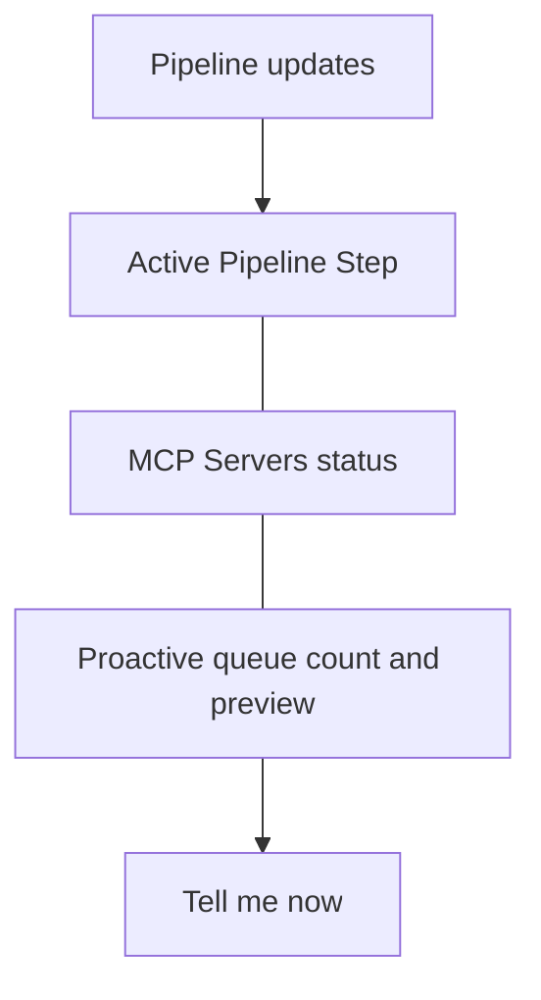

# Status Panel

Right panel: live pipeline step, MCP server status, and proactive queue.

## Source Mapping

| Source | Reference |
|--------|-----------|
| chat-ui.md | Section 2.3 (Status Panel) |
| chat-ui-flow.mermaid | `STATUS` `ST1`–`ST4`; `PIPELINE` → status |

## Responsibilities

Three live sections:

### Active Pipeline Step (`ST1`)

- Shows exactly which step C.O.B.R.A. is currently executing.
- Steps: Idle / Reasoning / Memory Retrieval / Tool Execution / Verification / Personality Mirror / Response Synthesis.
- Updates in **real time** as C.O.B.R.A. works.
- Idle when waiting for input.
- Fed by [pipeline-indicators.md](pipeline-indicators.md) and WebSocket ([technology-stack.md](technology-stack.md)).

### Connected MCP Servers (`ST2`)

- Lists all configured MCP servers with live status: **Online / Offline / Validating**.
- Updates automatically when server status changes.
- Data from [specs/mcp-server-layer/live-registry.md](../mcp-server-layer/live-registry.md).

### Proactive Items Queue (`ST3`, `ST4`)

- Shows **count** of queued proactive items waiting to surface.
- Displays a **preview** of the top priority item.
- User can tap **"Tell me now"** to surface the top item immediately (`ST4`).

## Inputs / Outputs

| Direction | Content |
|-----------|---------|
| **In** | WebSocket events from C.O.B.R.A. backend |
| **Out** | "Tell me now" user action |

## Flow

## Rules and Constraints

- All updates via WebSocket — no polling required for status.

## Open Items

- [ ] Define whether panels are resizable by the user

## Cross-References

- [pipeline-indicators.md](pipeline-indicators.md)
- [technology-stack.md](technology-stack.md)
- [specs/mcp-server-layer/live-registry.md](../mcp-server-layer/live-registry.md)
- [specs/brain/proactivity-engine.md](../brain/proactivity-engine.md)
