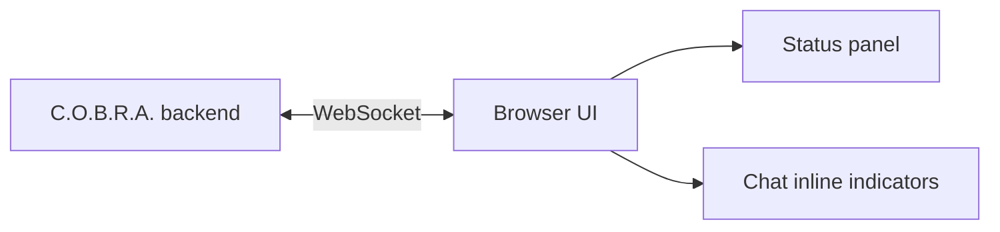

# Technology Stack

SPA frontend, local Python server, markdown rendering, and WebSocket realtime.

## Source Mapping

| Source | Reference |
|--------|-----------|
| chat-ui.md | Section 9 (Technology Stack) |
| chat-ui-flow.mermaid | `WS` `WS1`–`WS2`; `H` connected via WebSocket |

## Responsibilities

- **Frontend:** HTML, CSS, JavaScript — **single page application**.
- **Local server:** Python (**FastAPI or Flask**) serving the web app on localhost ([application-type.md](application-type.md)).
- **Markdown rendering:** Client-side markdown parser for wiki page display ([wiki-browser-panel.md](wiki-browser-panel.md)).
- **Real-time updates:** **WebSocket** connection between browser and C.O.B.R.A. backend for:
  - Live pipeline step updates
  - Status panel data (MCP servers, proactive queue)

Mermaid `WS`:

- `WS1` C.O.B.R.A. backend
- `WS2` Browser UI
- Bidirectional: live pipeline steps, MCP status, proactive queue

Processing path `H` is connected via WebSocket; `STATUS` receives updates from `WS`.

## Inputs / Outputs

| Direction | Content |
|-----------|---------|
| **In** | Backend events (pipeline, MCP, proactive) |
| **Out** | DOM updates in browser |

## Flow

## Rules and Constraints

- Fully offline — no CDN dependencies required for core function.
- Default port coordinated with config (open item).

## Open Items

- [ ] Define default localhost port
- [ ] Define markdown rendering library for wiki panel

## Cross-References

- [application-type.md](application-type.md)
- [wiki-browser-panel.md](wiki-browser-panel.md)
- [status-panel.md](status-panel.md)
- [pipeline-indicators.md](pipeline-indicators.md)
