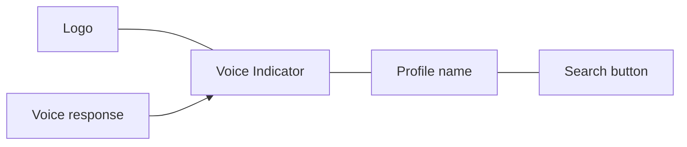

# Top Bar

Header with branding, voice indicator, profile name, and search entry.

## Source Mapping

| Source | Reference |
|--------|-----------|
| chat-ui.md | Section 3 (Top Bar) |
| chat-ui-flow.mermaid | `TOPBAR` `TB1`–`TB4`; `VOICE_IND` `VI1`–`VI3`; `RV` → `TB2` |

## Responsibilities

- **C.O.B.R.A. logo / name** — left aligned (`TB1`).
- **Voice Indicator** — always visible (`TB2`), shows current voice state:
  - Idle — waiting for wake word (`VI1`)
  - Listening — active session, ready for input (`VI2`)
  - Speaking — C.O.B.R.A. is playing a voice response (`VI3`)
- **Active profile name** — shows current profile (e.g. Default, Work) (`TB3`).
- **Search button** — opens full-text search overlay (`TB4` → [search.md](search.md)).

Voice playback updates indicator: `RV` (voice plays response) → `TB2`.

States align with [specs/voice/session-lifecycle.md](../voice/session-lifecycle.md).

## Inputs / Outputs

| Direction | Content |
|-----------|---------|
| **In** | Voice layer state; active profile from config |
| **Out** | Search overlay open action |

## Flow

## Rules and Constraints

- Voice indicator visible regardless of text vs voice input ([chat-panel.md](chat-panel.md) §5).

## Open Items

_None specific to this component._

## Cross-References

- [search.md](search.md)
- [chat-panel.md](chat-panel.md)
- [specs/voice/session-lifecycle.md](../voice/session-lifecycle.md)
- [specs/configuration/profiles.md](../configuration/profiles.md)
