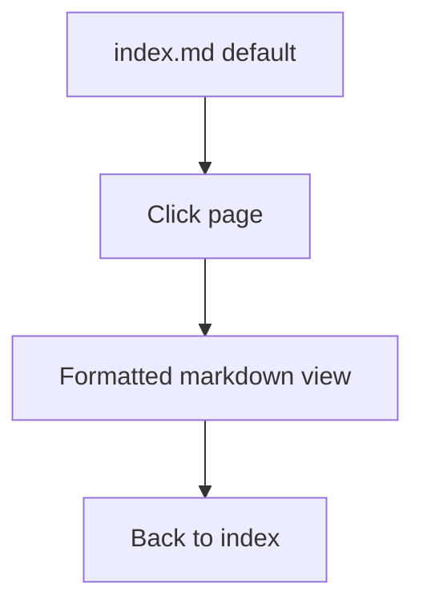

# Wiki Browser Panel

Center panel: read-only wiki navigation and markdown rendering.

## Source Mapping

| Source | Reference |
|--------|-----------|
| chat-ui.md | Section 2.2 (Wiki Browser Panel) |
| chat-ui-flow.mermaid | `WIKI` `WK1`–`WK5` |

## Responsibilities

- Displays the wiki **`index.md` by default** — full catalog of all pages (`WK1`).
- User can **click any wiki page** to open and read it (`WK2`).
- Pages render as **formatted markdown** (`WK3`).
- **Back navigation** to return to the index (`WK4`).
- **Read-only** — wiki is edited by C.O.B.R.A. only, not through the UI directly (`WK5`).

## Inputs / Outputs

| Direction | Content |
|-----------|---------|
| **In** | Wiki files from `~/.cobra/wiki/` ([specs/brain/wiki-operations.md](../brain/wiki-operations.md)) |
| **Out** | Rendered HTML in browser |

## Flow

## Rules and Constraints

- Client-side markdown parser per [technology-stack.md](technology-stack.md).
- No in-UI wiki editing.

## Open Items

- [ ] Define markdown rendering library for wiki panel

## Cross-References

- [technology-stack.md](technology-stack.md)
- [specs/brain/wiki-operations.md](../brain/wiki-operations.md)
- [chat-ui-overview.md](chat-ui-overview.md)
