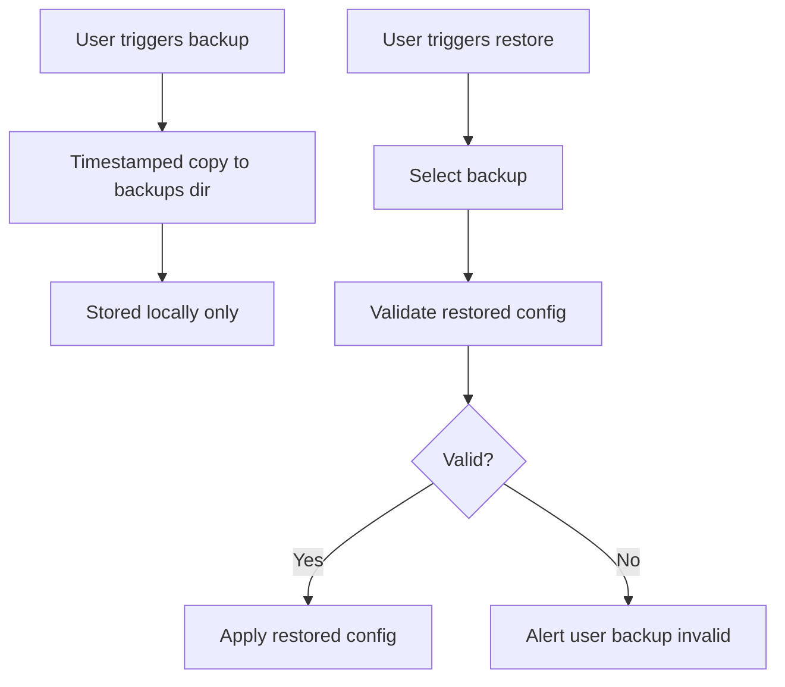

# Backup and Restore

Manual, local-only config backups with validated restore.

## Source Mapping

| Source | Reference |
|--------|-----------|
| configuration.md | Section 7 (Backup) |
| configuration-flow.mermaid | subgraph `BACKUP` (`BK1`–`BK9`) |

## Responsibilities

### Backup (configuration.md §7, `BK1`–`BK3`)

- User triggers backup via command (`BK1`).
- Timestamped copy of config file saved to `~/.cobra/backups/` (`BK2`).
- **`BK3`:** Stored locally only — never uploaded.

### Restore (`BK4`–`BK9`)

- **`BK4`:** User triggers restore via command.
- **`BK5`:** Select backup to restore.
- **`BK6`:** Validate restored config.
- **`BK7`:** Valid?
  - **Yes (`BK8`):** Apply restored config.
  - **No (`BK9`):** Alert user — backup invalid.

C.O.B.R.A. validates restored config before applying (configuration.md §7).

Active when `READY` --- `BACKUP` (diagram).

## Inputs / Outputs

| Direction | Content |
|-----------|---------|
| **In** | User backup/restore commands; files in `backups_dir` |
| **Out** | New timestamped backup; or applied/restored config |

## Flow

## Rules and Constraints

- Manual only — not automatic scheduled backup.
- Local-only — never uploaded ([privacy.md](privacy.md) `PR3`).

## Open Items

- [ ] Define maximum number of backup files retained before oldest is pruned (configuration.md Open Items)

## Cross-References

- [storage.md](storage.md) — source config file
- [config-file-structure.md](config-file-structure.md) — `backups_dir`, `CF3`
- [startup-validation.md](startup-validation.md) — `BK6` validation
- [privacy.md](privacy.md)
