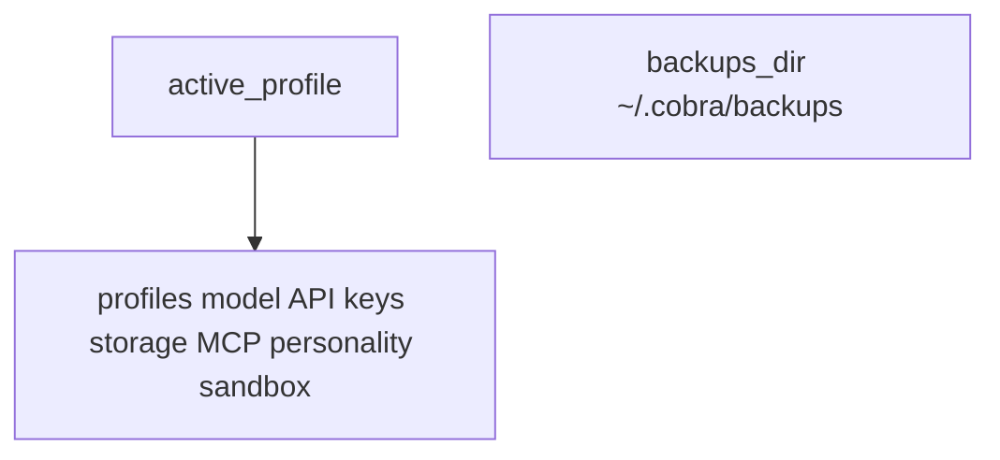

# Config File Structure

YAML schema for `~/.cobra/config.yaml` and profile records.

## Source Mapping

| Source | Reference |
|--------|-----------|
| configuration.md | Section 8 (Config File Structure) |
| configuration-flow.mermaid | subgraph `CONFIG` (`CF1`–`CF3`) |

## Responsibilities

Define the on-disk structure (configuration.md §8):

```yaml
# C.O.B.R.A. Configuration
version: "1.0"

active_profile: default

profiles:
  default:
    name: Default
    model:
      provider: lm_studio
      endpoint: http://localhost:1234
      model_id: ""           # e.g. llama-3-8b-instruct
    api_keys:
      claude: ""
      copilot: ""
    storage:
      wiki_dir: ~/.cobra/wiki/
      memory_dir: ~/.cobra/memory/
      logs_dir: ~/.cobra/logs/
      backups_dir: ~/.cobra/backups/
    mcp_servers: []          # list of MCP server configs
    personality_mode: default
    tool_sandbox: true       # sandboxed by default

  work:
    name: Work
    # ... same structure as default
```

### Diagram mapping

- **`CF1`:** `active_profile`
- **`CF2`:** `profiles` — name, model, API keys, storage, MCP servers, personality, sandbox per profile
- **`CF3`:** Backups directory `~/.cobra/backups/` (referenced in backup flow)

## Inputs / Outputs

| Direction | Content |
|-----------|---------|
| **In** | Wizard `W10`; profile edits; restore from backup |
| **Out** | Parsed config object consumed by validation, profiles, hot reload |

## Flow



## Rules and Constraints

- `version: "1.0"` documents config format generation.
- Each profile shares the same structural shape as `default`.
- Enforced by [privacy.md](privacy.md) (`CONFIG` -.-> `PRIVACY`).

## Open Items

- [ ] Define whether profiles can inherit from a base profile to avoid duplication (configuration.md Open Items)

## Cross-References

- [storage.md](storage.md)
- [profiles.md](profiles.md)
- [startup-validation.md](startup-validation.md)
- [backup-restore.md](backup-restore.md)
