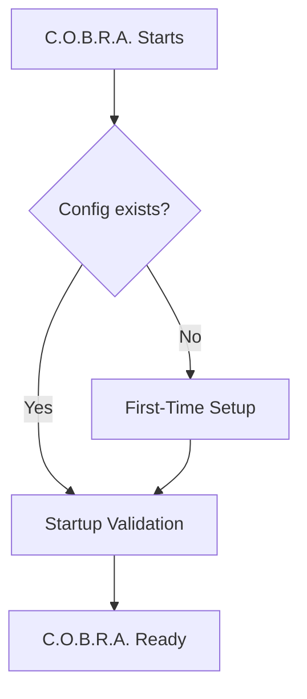

# C.O.B.R.A. Configuration — Component Overview

*Cognitive Optimized Brain for Retrieval and Action*

**Status:** Draft  
**Version:** 1.0 (decomposed)  
**Parent sources:** [../configuration.md](../configuration.md), [../configuration-flow.mermaid](../configuration-flow.mermaid)  
**Owner:** Damian  

---

## Purpose

The Configuration component manages how C.O.B.R.A. is set up, validated, and maintained across sessions. It covers:

- Storage and schema
- Profiles and API key management
- Startup behavior and LM Studio availability
- Hot reload
- Backup and restore

Configuration is **local-only** and never shared externally.

---

## High-Level Flow

Authoritative diagram: [../configuration-flow.mermaid](../configuration-flow.mermaid).

---

## Component Index

| Component | Spec | configuration.md | configuration-flow.mermaid |
|-----------|------|-------------------|---------------------------|
| Storage | [storage.md](storage.md) | §1 | Paths, `W7`/`W8` |
| Config File Structure | [config-file-structure.md](config-file-structure.md) | §8 | `CONFIG` `CF1`–`CF3` |
| First-Time Setup | [first-time-setup.md](first-time-setup.md) | §2 | `WIZARD` `W1`–`W10` |
| Startup Flow | [startup-flow.md](startup-flow.md) | Overview, §3–4 gates | `A`, `B`, `C`, `READY`, `ERR` |
| Startup Validation | [startup-validation.md](startup-validation.md) | §3 | `VALIDATE` `V1`–`V9` |
| LM Studio Wait | [lm-studio-wait.md](lm-studio-wait.md) | §4 | `LM_WAIT` `LM1`–`LM4` |
| Profiles | [profiles.md](profiles.md) | §5 | `PROFILES` `P1`–`P5` |
| Hot Reload | [hot-reload.md](hot-reload.md) | §6 | `HOTRELOAD` `HR1`–`HR5` |
| Backup and Restore | [backup-restore.md](backup-restore.md) | §7 | `BACKUP` `BK1`–`BK9` |
| Privacy | [privacy.md](privacy.md) | §9 | `PRIVACY` `PR1`–`PR3` |

**Implementation sequencing:** [implementation-plan.md](implementation-plan.md)

---

## Cross-Cutting Rules

1. **Single local config file** — `~/.cobra/config.yaml`, human-readable ([storage.md](storage.md)).
2. **Validate before work** — full checks every start ([startup-validation.md](startup-validation.md)).
3. **LM Studio gate** — no start until reachable + model loaded; retry until success or user cancel ([lm-studio-wait.md](lm-studio-wait.md)).
4. **Hot reload** — immediate apply; invalid fields reverted ([hot-reload.md](hot-reload.md)).
5. **Manual local backup** — timestamped copies under `~/.cobra/backups/` ([backup-restore.md](backup-restore.md)).
6. **Privacy** — never sync or upload config ([privacy.md](privacy.md)).

---

## Open Items (from configuration.md)

- [ ] Define config file change detection mechanism (file watcher vs. polling interval)
- [ ] Define LM Studio retry interval (e.g. every 5 seconds)
- [ ] Define whether API key format validation runs on startup or only on first use
- [ ] Define maximum number of backup files retained before oldest is pruned
- [ ] Define whether profiles can inherit from a base profile to avoid duplication

Tracked in owner specs and [implementation-plan.md](implementation-plan.md).

---

*Decomposed from configuration.md and configuration-flow.mermaid. Parent spec remains authoritative; these files add implementable component boundaries.*
