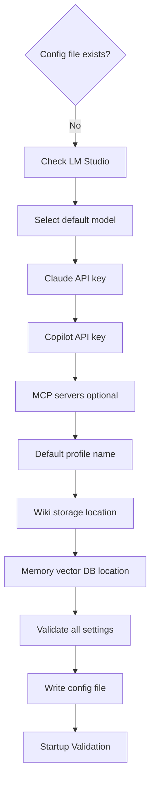

# First-Time Setup

Guided setup wizard when no config file exists; re-runnable via settings command.

## Source Mapping

| Source | Reference |
|--------|-----------|
| configuration.md | Section 2 (First-Time Setup) |
| configuration-flow.mermaid | subgraph `WIZARD` (`W1`–`W10`); `B` → No → `WIZARD` |

## Responsibilities

On first launch, detect missing config (`B` → No) and run wizard:

| Step | Node | Action |
|------|------|--------|
| 1 | `W1` | Check LM Studio — installed and running |
| 2 | `W2` | Select default model from available LM Studio models |
| 3 | `W3` | Enter Claude API key |
| 4 | `W4` | Enter Copilot API key |
| 5 | `W5` | Configure MCP servers (optional; can add later) |
| 6 | `W6` | Set default profile name |
| 7 | `W7` | Choose wiki storage location (default: `~/.cobra/wiki/`) |
| 8 | `W8` | Choose memory/vector DB location (default: `~/.cobra/memory/`) |
| 9 | `W9` | Validate all settings |
| 10 | `W10` | Write config file and launch C.O.B.R.A. |

Flow: `W1` → `W2` → … → `W10` → `VALIDATE` ([startup-validation.md](startup-validation.md)).

Wizard may be **re-run at any time** via a settings command (configuration.md §2).

## Inputs / Outputs

| Direction | Content |
|-----------|---------|
| **In** | User inputs per step; LM Studio model list |
| **Out** | Written config file → startup validation |

## Flow

## Rules and Constraints

- MCP configuration optional at setup.
- Defaults for storage paths as specified in configuration.md §2 steps 7–8.

## Open Items

_None specific to this component._

## Cross-References

- [startup-flow.md](startup-flow.md) — `B` routing
- [config-file-structure.md](config-file-structure.md) — `W10` output
- [startup-validation.md](startup-validation.md)
