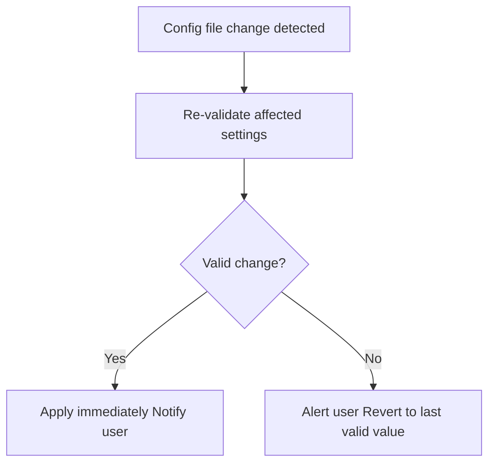

# Hot Reload

Applies config file changes at runtime without restarting C.O.B.R.A.

## Source Mapping

| Source | Reference |
|--------|-----------|
| configuration.md | Section 6 (Hot Reload) |
| configuration-flow.mermaid | subgraph `HOTRELOAD` (`HR1`–`HR5`) |

## Responsibilities

All configuration changes apply immediately without restart (configuration.md §6):

- **`HR1`:** Config file change detected automatically.
- **`HR2`:** Re-validate affected settings on change.
- **`HR3`:** Valid change?
  - **Yes (`HR4`):** Apply immediately; notify user.
  - **No (`HR5`):** Alert user; revert **that specific setting** to last valid value.

User is notified of **every** hot reload event.

Active when `READY` --- `HOTRELOAD` (diagram).

## Inputs / Outputs

| Direction | Content |
|-----------|---------|
| **In** | File change on `~/.cobra/config.yaml` ([storage.md](storage.md)) |
| **Out** | Updated runtime config or reverted field + user notification |

## Flow

## Rules and Constraints

- Per-setting revert on invalid change — not full-file rollback unless required by implementation.
- Re-validation scope: affected settings only (configuration.md §6).

## Open Items

- [ ] Define config file change detection mechanism (file watcher vs. polling interval) (configuration.md Open Items)

## Cross-References

- [storage.md](storage.md)
- [startup-validation.md](startup-validation.md) — validation rules reused
- [config-file-structure.md](config-file-structure.md)
- [startup-flow.md](startup-flow.md) — `READY`
