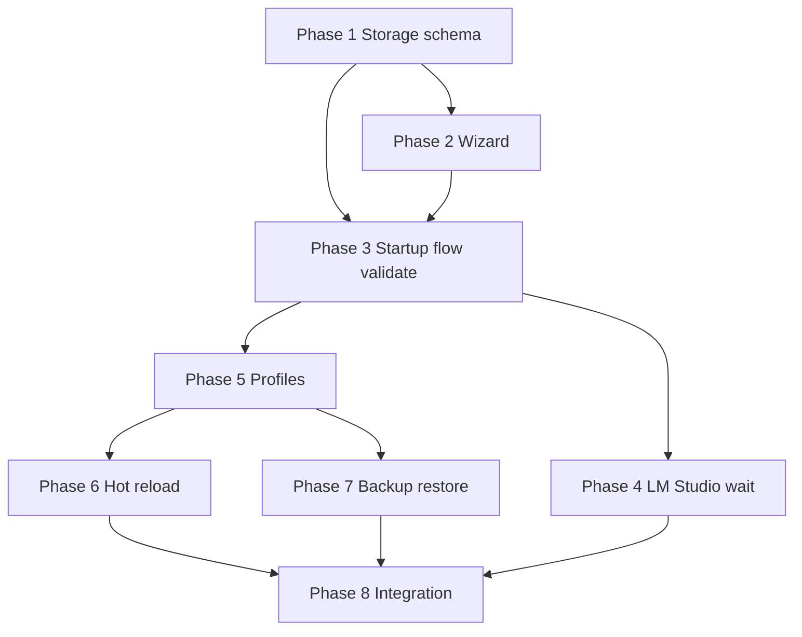

# Configuration — Implementation Plan

Phased build order for the C.O.B.R.A. Configuration component. Each phase maps to specs in this folder. **No implementation begins without user approval** (per parent [../configuration.md](../configuration.md)).

---

## Blocking Decisions (configuration.md Open Items)

| Open item | Blocks | Owner spec |
|-----------|--------|------------|
| Config change detection (watcher vs polling) | Phase 6 hot reload | [hot-reload.md](hot-reload.md) |
| LM Studio retry interval | Phase 4 LM wait | [lm-studio-wait.md](lm-studio-wait.md) |
| API key format validation timing | Phase 3 startup validation | [startup-validation.md](startup-validation.md) |
| Max backup retention before prune | Phase 7 backup | [backup-restore.md](backup-restore.md) |
| Profile inheritance from base | Phase 5 profiles | [profiles.md](profiles.md) |

---

## Phase 1 — Storage and Schema

**Goal:** Read/write local config file with documented YAML shape.

| Deliverable | Spec |
|-------------|------|
| `~/.cobra/config.yaml` load/save | [storage.md](storage.md) |
| Parse/serialize per §8 schema | [config-file-structure.md](config-file-structure.md) |
| Privacy: no sync/upload | [privacy.md](privacy.md) |

**Exit criteria:** Round-trip default profile; paths resolve for wiki/memory/logs/backups.

---

## Phase 2 — First-Time Setup Wizard

**Goal:** Guided `W1`–`W10` when config missing.

| Deliverable | Spec |
|-------------|------|
| Wizard steps 1–10 | [first-time-setup.md](first-time-setup.md) |
| Re-run via settings command | [first-time-setup.md](first-time-setup.md) |
| Write config → validation handoff | [startup-flow.md](startup-flow.md) |

**Exit criteria:** Fresh install produces valid config and enters validation.

---

## Phase 3 — Startup Flow and Validation

**Goal:** `A` → `B` → `VALIDATE` → `C` → `READY` or `ERR`.

| Deliverable | Spec |
|-------------|------|
| Entry orchestration | [startup-flow.md](startup-flow.md) |
| Checks `V1`–`V9` with actionable errors | [startup-validation.md](startup-validation.md) |
| `ERR` → user fix → restart path | [startup-flow.md](startup-flow.md) |

**Exit criteria:** Invalid config reports exact failure; valid config reaches `READY`.

**Blocked by:** API key format validation timing.

---

## Phase 4 — LM Studio Wait Loop

**Goal:** Background retry without timeout until success or cancel.

| Deliverable | Spec |
|-------------|------|
| `LM1`–`LM3` retry loop | [lm-studio-wait.md](lm-studio-wait.md) |
| Manual cancel `LM4` | [lm-studio-wait.md](lm-studio-wait.md) |
| Re-enter validation on success | [startup-validation.md](startup-validation.md) |

**Exit criteria:** Unreachable LM Studio blocks start; recovery returns to `VALIDATE`.

**Blocked by:** retry interval.

---

## Phase 5 — Profiles

**Goal:** Multi-profile config with immediate switch.

| Deliverable | Spec |
|-------------|------|
| Profile records per schema | [profiles.md](profiles.md), [config-file-structure.md](config-file-structure.md) |
| Switch command + `P4` re-validation | [profiles.md](profiles.md) |
| Default profile on startup `P5` | [profiles.md](profiles.md) |

**Exit criteria:** Switch profile without restart; validation runs on switch.

**Blocked by:** profile inheritance design (optional).

---

## Phase 6 — Hot Reload

**Goal:** Runtime config updates with per-field revert.

| Deliverable | Spec |
|-------------|------|
| Change detection `HR1` | [hot-reload.md](hot-reload.md) |
| Partial re-validation `HR2`–`HR3` | [hot-reload.md](hot-reload.md) |
| Apply + notify `HR4`; revert `HR5` | [hot-reload.md](hot-reload.md) |

**Exit criteria:** Edit config on disk updates runtime; bad field reverts with alert.

**Blocked by:** watcher vs polling.

---

## Phase 7 — Backup and Restore

**Goal:** Manual local backup/restore with validation.

| Deliverable | Spec |
|-------------|------|
| Timestamped backup command `BK1`–`BK3` | [backup-restore.md](backup-restore.md) |
| Restore flow `BK4`–`BK9` | [backup-restore.md](backup-restore.md) |

**Exit criteria:** Backup file created under `~/.cobra/backups/`; invalid restore rejected.

**Blocked by:** retention prune policy.

---

## Phase 8 — Integration Hardening

**Goal:** Brain/tools consume config; end-to-end startup.

| Deliverable | Spec |
|-------------|------|
| Brain model layer reads LM Studio settings | [config-file-structure.md](config-file-structure.md) |
| Verification API keys from active profile | [startup-validation.md](startup-validation.md) |
| Full [../configuration-flow.mermaid](../configuration-flow.mermaid) path | [configuration-overview.md](configuration-overview.md) |

**Exit criteria:** All open items closed or explicitly deferred with user approval.

---

## Dependency Graph

---

## Spec File Checklist

- [storage.md](storage.md)
- [config-file-structure.md](config-file-structure.md)
- [first-time-setup.md](first-time-setup.md)
- [startup-flow.md](startup-flow.md)
- [startup-validation.md](startup-validation.md)
- [lm-studio-wait.md](lm-studio-wait.md)
- [profiles.md](profiles.md)
- [hot-reload.md](hot-reload.md)
- [backup-restore.md](backup-restore.md)
- [privacy.md](privacy.md)
- [configuration-overview.md](configuration-overview.md)
- [implementation-plan.md](implementation-plan.md)
