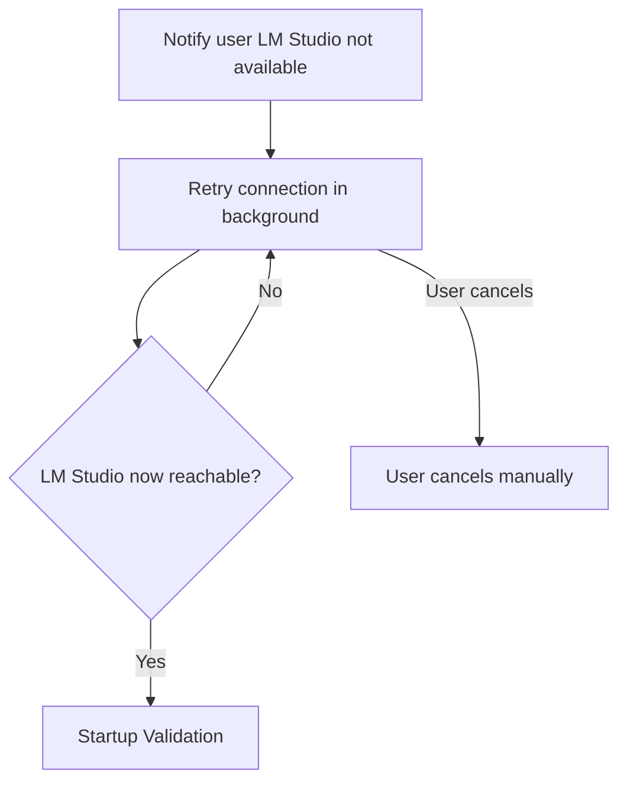

# LM Studio Wait

Background retry when LM Studio is unreachable at startup; no timeout until user cancels.

## Source Mapping

| Source | Reference |
|--------|-----------|
| configuration.md | Section 4 (LM Studio Unavailable at Startup) |
| configuration-flow.mermaid | subgraph `LM_WAIT` (`LM1`–`LM4`); `C` → No LM Studio |

## Responsibilities

When LM Studio is not running or unreachable at startup (`C` → No — LM Studio unreachable):

- **`LM1`:** Notify user that LM Studio is not available.
- **`LM2`:** Retry connection automatically in the background at a **defined interval** (open item).
- **`LM3`:** LM Studio now reachable?
  - **No** → return to `LM2` (keep retrying).
  - **Yes** → return to `VALIDATE` ([startup-validation.md](startup-validation.md)).
- **`LM4`:** User can cancel manually (`LM2` → User cancels → `LM4`).

Policy (configuration.md §4):

- Does **not** start until LM Studio is confirmed reachable **and** model is loaded.
- **Never times out** — keeps retrying until connection established.
- User may cancel wait at any time.

## Inputs / Outputs

| Direction | Content |
|-----------|---------|
| **In** | Failed `V3`/`V4` from startup validation |
| **Out** | Success → re-enter `VALIDATE`; cancel → user exits wait |

## Flow

## Rules and Constraints

- No automatic timeout on retry loop.
- Must confirm model loaded before proceeding (via re-validation `V4`).

## Open Items

- [ ] Define LM Studio retry interval (e.g. every 5 seconds) (configuration.md Open Items)

## Cross-References

- [startup-flow.md](startup-flow.md) — branch from `C`
- [startup-validation.md](startup-validation.md) — `V3`, `V4`
- [config-file-structure.md](config-file-structure.md) — `model.endpoint`, `model_id`
