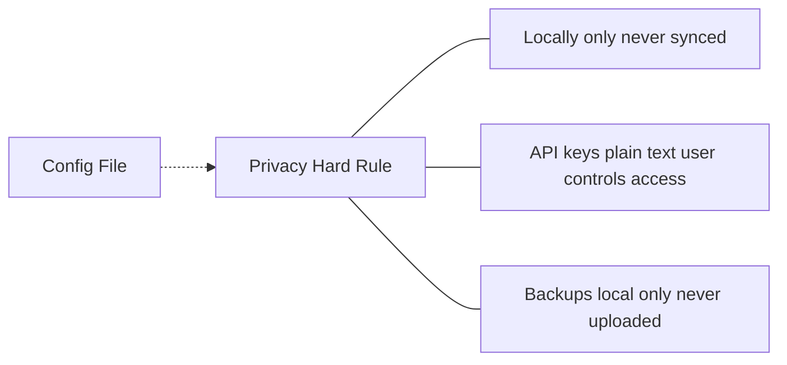

# Privacy (Hard Rule)

Local-only configuration and backups; no external transmission of config data.

## Source Mapping

| Source | Reference |
|--------|-----------|
| configuration.md | Section 9 (Privacy — Hard Rule); §1 storage rule |
| configuration-flow.mermaid | subgraph `PRIVACY` (`PR1`–`PR3`); `CONFIG` -.-> `PRIVACY` |

## Responsibilities

### configuration.md §9

- Config file stored **locally only** — never synced or uploaded.
- API keys stored as **plain text locally** — user responsible for file-level access control.
- Backups follow same **local-only** rule.
- **No configuration data is ever sent externally.**

### Diagram nodes

- **`PR1`:** Config stored locally only — never synced or uploaded.
- **`PR2`:** API keys plain text locally — user controls file access.
- **`PR3`:** Backups local only — never uploaded.

Enforcement: `CONFIG` -.-> enforced by `PRIVACY`.

Aligns with brain/tools privacy: configuration enables API keys used elsewhere but config itself never leaves machine.

## Inputs / Outputs

| Direction | Content |
|-----------|---------|
| **In** | Config writes, backups, profile data |
| **Out** | Local persistence only; no outbound config sync |

## Flow

## Rules and Constraints

- Config file never synced, uploaded, or shared externally (§1 + §9).
- User owns filesystem permissions for `~/.cobra/`.

## Open Items

_None beyond global configuration open items._

## Cross-References

- [storage.md](storage.md)
- [backup-restore.md](backup-restore.md)
- [config-file-structure.md](config-file-structure.md)
