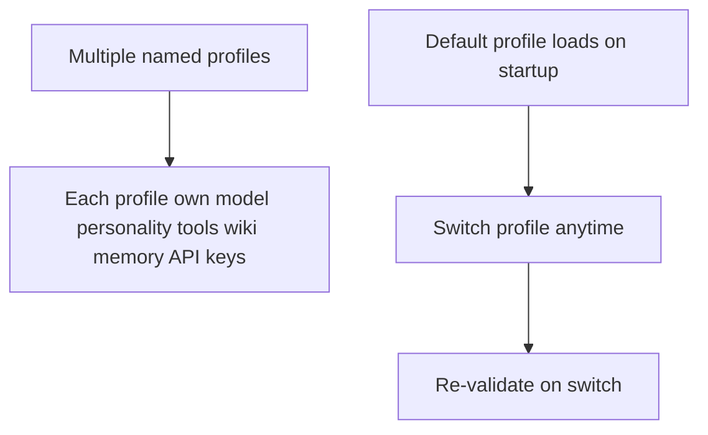

# Profiles

Multiple named configuration profiles with immediate switching and startup default.

## Source Mapping

| Source | Reference |
|--------|-----------|
| configuration.md | Section 5 (Profiles), 5.1–5.2 |
| configuration-flow.mermaid | subgraph `PROFILES` (`P1`–`P5`) |

## Responsibilities

### Profile contents (`P1` → `P2`)

Each named profile may define its own:

- Active LM Studio model
- Personality mode (e.g. professional, personal)
- Tool permissions and sandbox overrides
- Wiki and memory directories
- MCP server connections
- API keys (if different per profile)

### Switching (`P3` → `P4`, configuration.md §5.1)

- User switches profiles anytime via command.
- Switch applies **immediately** — no restart required.
- **`P4`:** Re-validate new profile's settings on switch ([startup-validation.md](startup-validation.md)).

### Default profile (`P5`, configuration.md §5.2)

- One profile designated default; loads automatically on startup (`active_profile` in [config-file-structure.md](config-file-structure.md)).
- User may change default profile anytime.

Diagram: `P5` → `P3`; `P1` → `P2`; `P3` → `P4`.

Active at runtime when `READY` --- `PROFILES` (diagram).

## Inputs / Outputs

| Direction | Content |
|-----------|---------|
| **In** | User profile switch command; `active_profile` from config |
| **Out** | Applied profile settings; validation pass/fail |

## Flow

## Rules and Constraints

- Profile switch is hot — no full process restart.
- Failed validation after switch must block or report per startup validation rules.

## Open Items

- [ ] Define whether profiles can inherit from a base profile to avoid duplication (configuration.md Open Items)

## Cross-References

- [config-file-structure.md](config-file-structure.md) — `profiles`, `active_profile`
- [startup-validation.md](startup-validation.md) — `V9`, `P4`
- [startup-flow.md](startup-flow.md) — `READY`
