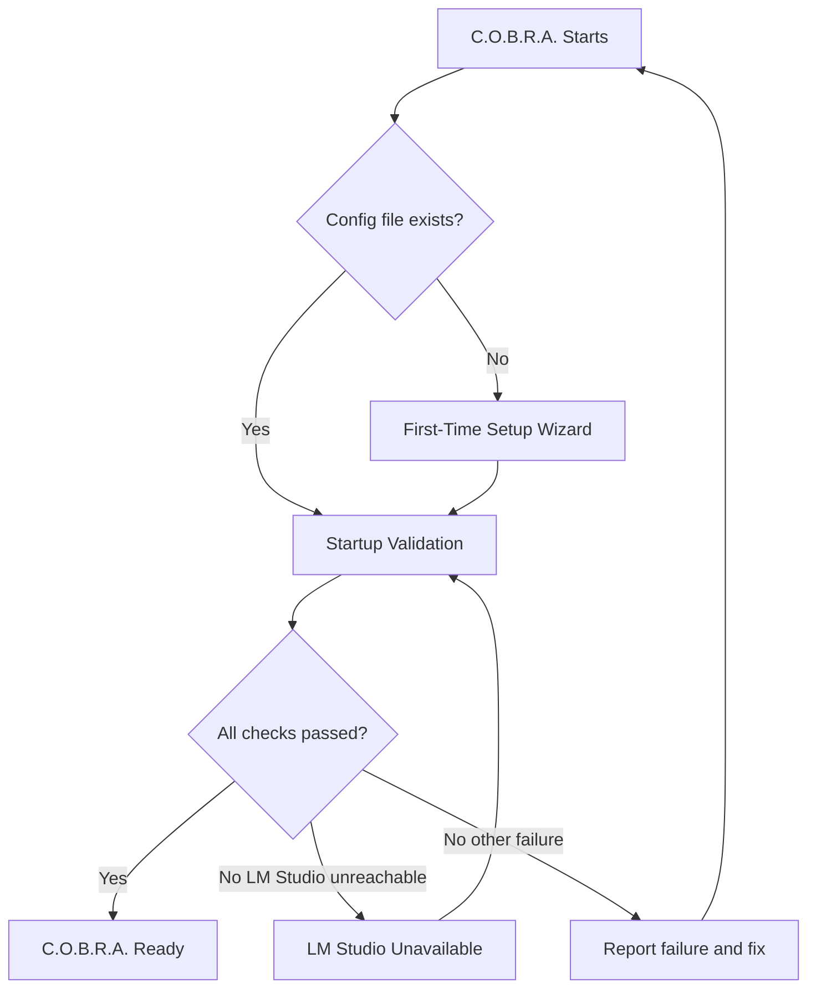

# Startup Flow

Top-level orchestration from C.O.B.R.A. start through ready state or error recovery.

## Source Mapping

| Source | Reference |
|--------|-----------|
| configuration.md | Overview; §3 intro; §4 branch from failed validation |
| configuration-flow.mermaid | `A`, `B`, `C`, `READY`, `ERR` |

## Responsibilities

- **`A`:** C.O.B.R.A. starts.
- **`B`:** Config file exists?
  - **No** → [first-time-setup.md](first-time-setup.md) `WIZARD` → `W10` → `VALIDATE`
  - **Yes** → [startup-validation.md](startup-validation.md) `VALIDATE`
- **`C`:** All checks passed? (after `V1`–`V9`)
  - **Yes** → `READY` C.O.B.R.A. Ready
  - **No — LM Studio unreachable** → [lm-studio-wait.md](lm-studio-wait.md) `LM_WAIT`
  - **No — other failure** → `ERR`
- **`ERR`:** Report exactly what failed and how to fix it → loop to `A` (restart flow per diagram).
- **`READY`:** Runtime; linked at diagram level to [profiles.md](profiles.md), [hot-reload.md](hot-reload.md), [backup-restore.md](backup-restore.md), [config-file-structure.md](config-file-structure.md).

Nothing else runs until startup validation completes successfully (configuration.md §3).

## Inputs / Outputs

| Direction | Content |
|-----------|---------|
| **In** | Process start |
| **Out** | `READY` or blocked on wizard / validation / LM wait / error report |

## Flow

## Rules and Constraints

- Full configuration validated before other work (§3).
- LM Studio unreachable uses dedicated wait loop — not generic `ERR` only.

## Open Items

_None specific to this component._

## Cross-References

- [first-time-setup.md](first-time-setup.md)
- [startup-validation.md](startup-validation.md)
- [lm-studio-wait.md](lm-studio-wait.md)
