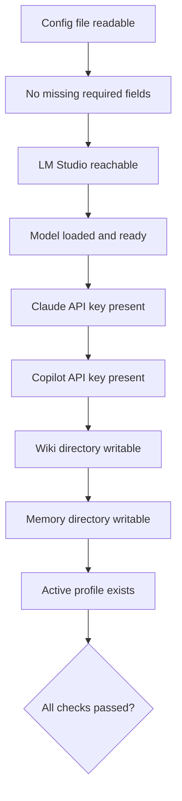

# Startup Validation

Validates full configuration on every start before C.O.B.R.A. proceeds.

## Source Mapping

| Source | Reference |
|--------|-----------|
| configuration.md | Section 3 (Startup Validation) |
| configuration-flow.mermaid | subgraph `VALIDATE` (`V1`–`V9`); gate `C` |

## Responsibilities

Every startup runs checks in order (`V1` → `V2` → … → `V9`):

| Check | Node | What it validates |
|-------|------|-------------------|
| Config file exists | (implicit before `VALIDATE` via `B`) | Present and readable |
| Config file valid | `V1` / `V2` | `V1` readable; `V2` no malformed or missing required fields |
| LM Studio reachable | `V3` | API endpoint responds at configured URL |
| Model loaded | `V4` | Selected model loaded and ready in LM Studio |
| Claude API key | `V5` | Key present — format check only, not a live call |
| Copilot API key | `V6` | Key present — format check only, not a live call |
| Wiki directory | `V7` | Wiki storage location exists and is writable |
| Memory directory | `V8` | Vector DB location exists and is writable |
| Active profile | `V9` | Selected profile exists in config |

Diagram nodes: `V1` Config file readable → `V2` No missing required fields → `V3`–`V9` as above.

If any check fails: report **exactly** what failed and what to do to fix it before proceeding (configuration.md §3).

Re-run on profile switch ([profiles.md](profiles.md) `P4`).

## Inputs / Outputs

| Direction | Content |
|-----------|---------|
| **In** | Config file from [storage.md](storage.md); active profile |
| **Out** | Pass → `C` Yes → `READY`; fail → LM wait or `ERR` |

## Flow

## Rules and Constraints

- API key checks: format/presence only at startup — not live API calls (configuration.md table).
- Failure must be explicit and actionable.

## Open Items

- [ ] Define whether API key format validation runs on startup or only on first use (configuration.md Open Items)

## Cross-References

- [startup-flow.md](startup-flow.md) — `C`, `ERR`
- [lm-studio-wait.md](lm-studio-wait.md) — `V3`/`V4` failures
- [profiles.md](profiles.md) — re-validate on switch
- [hot-reload.md](hot-reload.md) — partial re-validation on change
