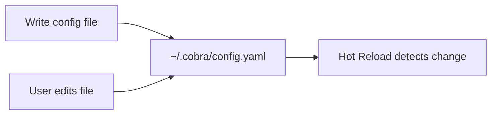

# Storage

Defines where and how C.O.B.R.A. configuration is persisted locally.

## Source Mapping

| Source | Reference |
|--------|-----------|
| configuration.md | Section 1 (Storage) |
| configuration-flow.mermaid | Implicit in `CONFIG`; wizard `W7`/`W8` defaults |

## Responsibilities

- Store all configuration in a **single local config file** on the user's machine.
- **Default location:** `~/.cobra/config.yaml`
- File is **human-readable** and editable directly.
- **Sensitive values (API keys)** stored as plain text within the config file.
- Config file is **never synced, uploaded, or shared externally** under any circumstances.

Related default paths (wizard / schema):

- Wiki: `~/.cobra/wiki/` (default in §2 step 7)
- Memory/vector DB: `~/.cobra/memory/` (default in §2 step 8)
- Backups: `~/.cobra/backups/` (§7, schema `backups_dir`)

## Inputs / Outputs

| Direction | Content |
|-----------|---------|
| **In** | Wizard write (`W10`); manual edits; hot reload reads |
| **Out** | Readable/writable config file at configured path |

## Flow

## Rules and Constraints

- Single local file — not distributed or cloud-synced.
- Plain-text API keys — user responsible for file-level access control (see [privacy.md](privacy.md)).

## Open Items

_None specific to this component._

## Cross-References

- [config-file-structure.md](config-file-structure.md) — YAML layout
- [first-time-setup.md](first-time-setup.md) — initial write
- [hot-reload.md](hot-reload.md) — change detection
- [privacy.md](privacy.md)
