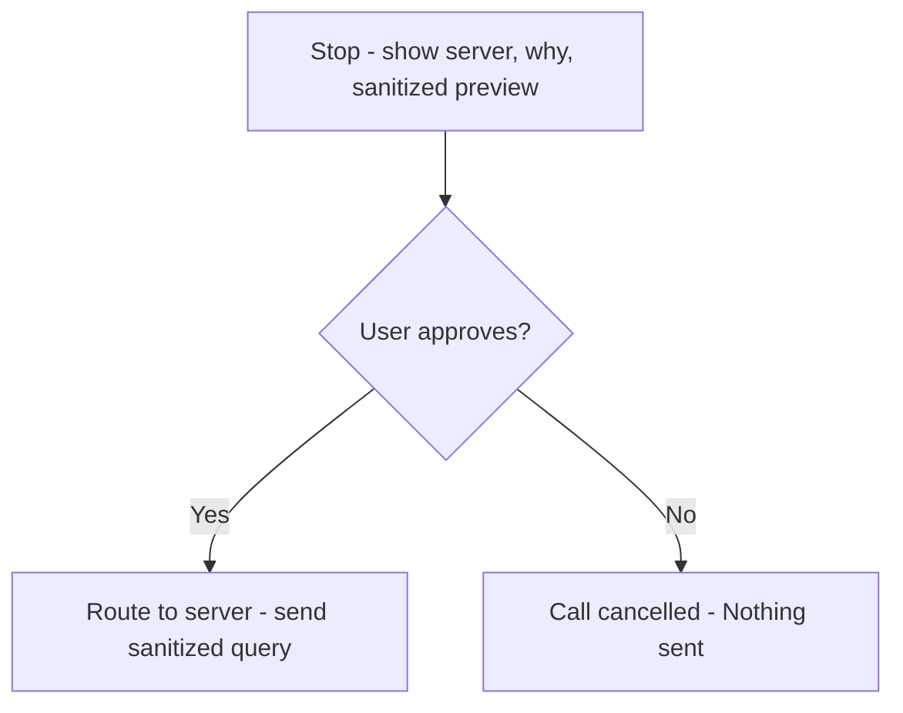

# Approval Model

Explicit user approval required before every MCP server call.

## Source Mapping

| Source | Reference |
|--------|-----------|
| mcp-server-layer.md | Section 4 (Approval Model) |
| mcp-server-layer-flow.mermaid | `E`, `F`, `DENIED` |

## Responsibilities

**Every MCP server call requires explicit user approval before execution — no exceptions.**

Before calling any MCP server, C.O.B.R.A.:

1. **Stops** and tells the user exactly **which server** it wants to call and **why** (`E`)
2. Shows what data will be sent to the server (**sanitized** — topic only, never personal context)
3. **Waits** for explicit user approval (`F`)
4. **Denied** = call is cancelled, nothing is sent (`DENIED`)

This applies to **all MCP calls** including verification pipeline queries.

UI presentation: inline approval card in Chat UI ([specs/chat-ui/approval-prompts.md](../chat-ui/approval-prompts.md)).

## Inputs / Outputs

| Direction | Content |
|-----------|---------|
| **In** | Selected server, capability, sanitized query preview |
| **Out** | Approved → proceed to `G`; Denied → cancel, log denial |

## Flow

## Rules and Constraints

- No bypass for verification or low-sensitivity calls.
- Aligns with master privacy rule ([privacy.md](privacy.md)) and tools approval ([specs/tools/approval-model.md](../tools/approval-model.md)).

## Open Items

_None specific to this component._

## Cross-References

- [privacy.md](privacy.md)
- [execution-flow.md](execution-flow.md)
- [logging.md](logging.md) — approval granted/denied logged
- [specs/chat-ui/approval-prompts.md](../chat-ui/approval-prompts.md)
