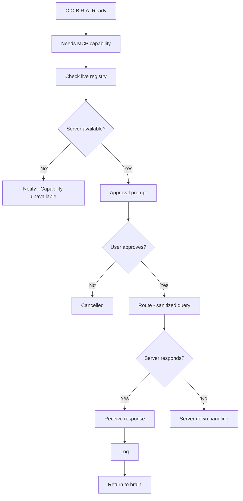

# Execution Flow

Runtime path from capability need through approval, call, logging, and return to the brain.

## Source Mapping

| Source | Reference |
|--------|-----------|
| mcp-server-layer.md | Overview (runtime behavior) |
| mcp-server-layer-flow.mermaid | `READY` → `B` → `C` → `D` → `E`–`J`; `UNAVAIL`; `DENIED` |

## Responsibilities

After startup (`READY` — all available servers connected):

1. `B` — C.O.B.R.A. needs MCP capability (from brain/tools/verification)
2. `C` — Check live registry for capable server ([routing-logic.md](routing-logic.md))
3. `D` — Server available?
   - **No** → `UNAVAIL` — Notify user; capability unavailable
   - **Yes** → [approval-model.md](approval-model.md) `E` → `F`
4. Approved → `G` — Route to server; send sanitized query (topic only)
5. `H` — Server responds?
   - **No** → [server-down-mid-session.md](server-down-mid-session.md)
   - **Yes** → `I` Receive response → [logging.md](logging.md) → `J` Return result to brain pipeline
6. Denied at `F` → `DENIED` — nothing sent

## Inputs / Outputs

| Direction | Content |
|-----------|---------|
| **In** | Capability request from brain pipeline |
| **Out** | Result or cancellation to brain pipeline |

## Flow

## Rules and Constraints

- Every call path goes through approval and privacy sanitization.
- Partial fleet operation when some servers unavailable.

## Open Items

- [ ] Define what happens to a paused task when a server comes back online — auto-resume or require user to re-trigger

## Cross-References

- [routing-logic.md](routing-logic.md)
- [approval-model.md](approval-model.md)
- [server-down-mid-session.md](server-down-mid-session.md)
- [logging.md](logging.md)
- [live-registry.md](live-registry.md)
- [specs/brain/verification-pipeline.md](../brain/verification-pipeline.md)
