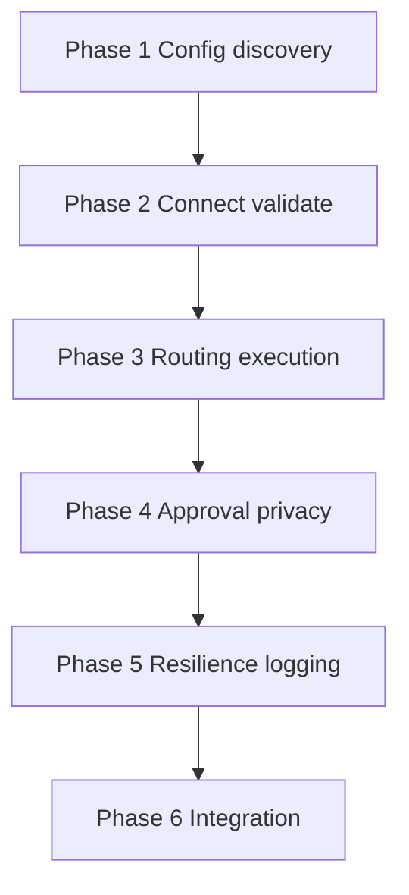

# MCP Server Layer — Implementation Plan

Phased build order for the C.O.B.R.A. MCP Server Layer component. Each phase maps to specs in this folder. **No implementation begins without user approval** (per parent [../mcp-server-layer.md](../mcp-server-layer.md)).

---

## Blocking Decisions (mcp-server-layer.md Open Items)

| Open item | Blocks | Owner spec |
|-----------|--------|------------|
| Retry interval / max retries | Phase 5 server down | [server-down-mid-session.md](server-down-mid-session.md) |
| MCP protocol version compatibility | Phase 2 startup validation | [startup-validation.md](startup-validation.md) |
| Conflicting capabilities (two servers) | Phase 3 routing | [routing-logic.md](routing-logic.md) |
| Manual routing priority per server | Phase 3 routing, Phase 1 config | [routing-logic.md](routing-logic.md), [config-structure.md](config-structure.md) |
| Paused task resume on server recovery | Phase 5 server down, Phase 4 execution | [server-down-mid-session.md](server-down-mid-session.md), [execution-flow.md](execution-flow.md) |

---

## Phase 1 — Config and Discovery

**Goal:** Parse and register manually configured MCP servers.

| Deliverable | Spec |
|-------------|------|
| `mcp_servers` YAML schema | [config-structure.md](config-structure.md) |
| Manual-only registration | [discovery.md](discovery.md) |
| Privacy rules documented | [privacy.md](privacy.md) |

**Exit criteria:** Load server list from config; reject auto-discovery paths.

---

## Phase 2 — Connect and Validate

**Goal:** `STARTUP` `S1`–`S7` → populate live registry.

| Deliverable | Spec |
|-------------|------|
| Simultaneous connect | [multi-server-support.md](multi-server-support.md) |
| Reachability, capabilities, protocol checks | [startup-validation.md](startup-validation.md) |
| Registry AVAILABLE/UNAVAILABLE | [live-registry.md](live-registry.md) |

**Exit criteria:** Partial startup with user notification on failures; `READY` with available servers.

**Blocked by:** MCP protocol version requirements.

---

## Phase 3 — Routing and Execution Spine

**Goal:** Capability → server selection → approval gate → call.

| Deliverable | Spec |
|-------------|------|
| `RT1`–`RT5` routing | [routing-logic.md](routing-logic.md) |
| `B`–`J` runtime path, `UNAVAIL` | [execution-flow.md](execution-flow.md) |

**Exit criteria:** Brain request routes to correct server or reports unavailable.

**Blocked by:** conflicting capabilities; manual priority (optional).

---

## Phase 4 — Approval and Privacy Enforcement

**Goal:** No outbound call without approval and sanitization.

| Deliverable | Spec |
|-------------|------|
| `E`/`F`/`DENIED` flow | [approval-model.md](approval-model.md) |
| Topic-only outbound on `G` | [privacy.md](privacy.md) |
| Chat UI approval cards | [specs/chat-ui/approval-prompts.md](../chat-ui/approval-prompts.md) |

**Exit criteria:** Denied calls send nothing; approved calls are sanitized.

---

## Phase 5 — Resilience and Audit

**Goal:** Mid-session recovery, logging, wiki audit trail.

| Deliverable | Spec |
|-------------|------|
| `DOWN` `D1`–`D5` retry and pause | [server-down-mid-session.md](server-down-mid-session.md) |
| Wiki MCP log `L1`–`L6` | [logging.md](logging.md) |
| Status panel MCP list | [specs/chat-ui/status-panel.md](../chat-ui/status-panel.md) |

**Exit criteria:** Server failure degrades gracefully; every call logged locally.

**Blocked by:** retry interval/count; paused task resume policy.

---

## Phase 6 — Integration Hardening

**Goal:** Brain verification and tools consume MCP layer end-to-end.

| Deliverable | Spec |
|-------------|------|
| Verification pipeline MCP queries | [specs/brain/verification-pipeline.md](../brain/verification-pipeline.md) |
| Hot reload new servers without restart | [discovery.md](discovery.md) |
| Full [../mcp-server-layer-flow.mermaid](../mcp-server-layer-flow.mermaid) path | [mcp-server-layer-overview.md](mcp-server-layer-overview.md) |

**Exit criteria:** All open items closed or explicitly deferred with user approval.

---

## Dependency Graph

---

## Spec File Checklist

- [discovery.md](discovery.md)
- [multi-server-support.md](multi-server-support.md)
- [live-registry.md](live-registry.md)
- [startup-validation.md](startup-validation.md)
- [routing-logic.md](routing-logic.md)
- [approval-model.md](approval-model.md)
- [server-down-mid-session.md](server-down-mid-session.md)
- [logging.md](logging.md)
- [config-structure.md](config-structure.md)
- [privacy.md](privacy.md)
- [execution-flow.md](execution-flow.md)
- [mcp-server-layer-overview.md](mcp-server-layer-overview.md)
- [implementation-plan.md](implementation-plan.md)
