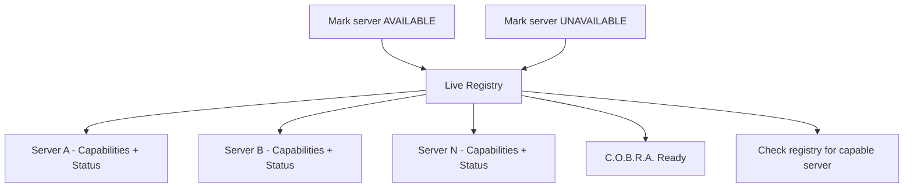

# Live Registry

Runtime catalog of MCP servers, their capabilities, and availability status.

## Source Mapping

| Source | Reference |
|--------|-----------|
| mcp-server-layer.md | Section 2 (registry bullet) |
| mcp-server-layer-flow.mermaid | `REGISTRY` subgraph `R1`–`R3`; `S6` → AVAILABLE; `S7` → UNAVAILABLE; `REGISTRY` → `READY` |

## Responsibilities

- Maintain a **live registry** of configured MCP servers after startup validation.
- Each entry tracks: server identity, **capabilities**, and **status** (available / unavailable).
- Registry entries updated when:
  - Startup validation marks server `S6` AVAILABLE or `S7` UNAVAILABLE
  - Mid-session recovery or failure ([server-down-mid-session.md](server-down-mid-session.md))
- Registry is consulted before every MCP call (`C` — check live registry for capable server).
- Chat UI status panel displays server list from this registry ([specs/chat-ui/status-panel.md](../chat-ui/status-panel.md)).

## Inputs / Outputs

| Direction | Content |
|-----------|---------|
| **In** | Validation results; runtime status changes |
| **Out** | Capability lookup for routing; UI status feed |

## Flow

## Rules and Constraints

- Failed validation → server flagged unavailable; user notified at startup.
- Registry must reflect **current** status for routing and UI.

## Open Items

_None specific to this component._

## Cross-References

- [multi-server-support.md](multi-server-support.md)
- [routing-logic.md](routing-logic.md)
- [execution-flow.md](execution-flow.md)
- [specs/chat-ui/status-panel.md](../chat-ui/status-panel.md)
