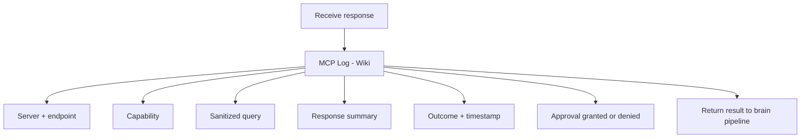

# Logging

Full local audit trail of every MCP server interaction in the wiki.

## Source Mapping

| Source | Reference |
|--------|-----------|
| mcp-server-layer.md | Section 6 (Logging) |
| mcp-server-layer-flow.mermaid | `LOG` subgraph `L1`–`L6`; success path `I` → `LOG` → `J` |

## Responsibilities

Every MCP server interaction is logged in full in the wiki under a **dedicated MCP log page**:

| Field | Detail |
|-------|--------|
| Server name and endpoint | `L1` |
| Capability invoked | `L2` |
| Sanitized query sent | `L3` — never raw personal data |
| Response received | `L4` — summarized if large |
| Outcome | `L5` — success, failure, timeout |
| Timestamp | `L5` |
| Approval | `L6` — granted or denied |

Additional rules from parent:

- Logs are stored **locally only** — never sent externally.
- Routing decisions are logged for every call ([routing-logic.md](routing-logic.md)).

## Inputs / Outputs

| Direction | Content |
|-----------|---------|
| **In** | Call metadata, sanitized query, response summary, approval outcome |
| **Out** | Wiki MCP log page entry |

## Flow

## Rules and Constraints

- Never log raw personal data in queries.
- Enforced by privacy hard rule ([privacy.md](privacy.md)).

## Open Items

_None specific to this component._

## Cross-References

- [privacy.md](privacy.md)
- [approval-model.md](approval-model.md)
- [routing-logic.md](routing-logic.md)
- [specs/brain/wiki-operations.md](../brain/wiki-operations.md)
