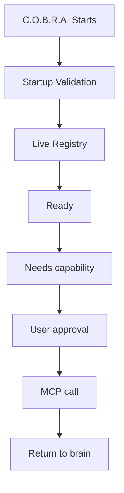

# C.O.B.R.A. MCP Server Layer — Component Overview

*Cognitive Optimized Brain for Retrieval and Action*

**Status:** Draft  
**Version:** 1.0 (decomposed)  
**Parent sources:** [../mcp-server-layer.md](../mcp-server-layer.md), [../mcp-server-layer-flow.mermaid](../mcp-server-layer-flow.mermaid)  
**Owner:** Damian  

---

## Purpose

The MCP Server Layer manages how C.O.B.R.A. connects to, validates, routes to, and monitors Model Context Protocol (MCP) servers. MCP servers extend C.O.B.R.A.'s capabilities for **tool use** and **external verification**.

Core principles:

- All connections are **manually configured**
- All calls require **user approval**
- All activity is **logged** locally in the wiki

---

## High-Level Flow

Authoritative diagram: [../mcp-server-layer-flow.mermaid](../mcp-server-layer-flow.mermaid).

---

## Component Index

| Component | Spec | mcp-server-layer.md | mcp-server-layer-flow.mermaid |
|-----------|------|---------------------|-------------------------------|
| Discovery | [discovery.md](discovery.md) | §1 | `S1`, `CONFIG` |
| Multi-Server Support | [multi-server-support.md](multi-server-support.md) | §2 | `S2` |
| Live Registry | [live-registry.md](live-registry.md) | §2 (registry) | `REGISTRY` `R1`–`R3` |
| Startup Validation | [startup-validation.md](startup-validation.md) | §3 | `STARTUP` `S1`–`S7` |
| Routing Logic | [routing-logic.md](routing-logic.md) | §2.1 | `ROUTING` `RT1`–`RT5` |
| Approval Model | [approval-model.md](approval-model.md) | §4 | `E`, `F`, `DENIED` |
| Server Down Mid-Session | [server-down-mid-session.md](server-down-mid-session.md) | §5 | `DOWN` `D1`–`D5` |
| Logging | [logging.md](logging.md) | §6 | `LOG` `L1`–`L6` |
| Privacy | [privacy.md](privacy.md) | §7 | `PRIVACY` `PR1`–`PR3` |
| Config Structure | [config-structure.md](config-structure.md) | §8 | `CONFIG` `CF1`–`CF5` |
| Execution Flow | [execution-flow.md](execution-flow.md) | Overview | `READY`→`B`→`J`, `UNAVAIL` |

**Implementation sequencing:** [implementation-plan.md](implementation-plan.md)

---

## Cross-Cutting Rules

1. **Manual discovery only** — no auto-scan ([discovery.md](discovery.md)).
2. **Simultaneous connections** — independent per server ([multi-server-support.md](multi-server-support.md)).
3. **Validate on startup** — partial fleet allowed ([startup-validation.md](startup-validation.md)).
4. **Approve every call** — no exceptions ([approval-model.md](approval-model.md)).
5. **Topic-only outbound** — sanitize before send ([privacy.md](privacy.md)).
6. **Log everything locally** — wiki MCP log page ([logging.md](logging.md)).

---

## Open Items (from mcp-server-layer.md)

- [ ] Define retry interval and maximum retry count before marking server unavailable
- [ ] Define MCP protocol version compatibility requirements
- [ ] Define behavior when two servers declare conflicting capabilities
- [ ] Define whether capability routing priority can be manually configured per server
- [ ] Define what happens to a paused task when a server comes back online — auto-resume or require user to re-trigger

Tracked in owner specs and [implementation-plan.md](implementation-plan.md).

---

*Decomposed from mcp-server-layer.md and mcp-server-layer-flow.mermaid. Parent spec remains authoritative; these files add implementable component boundaries.*
