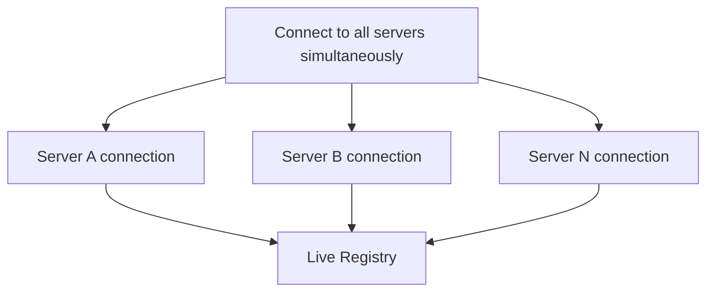

# Multi-Server Support

Simultaneous connections to all configured MCP servers with independent failure domains.

## Source Mapping

| Source | Reference |
|--------|-----------|
| mcp-server-layer.md | Section 2 (Multi-Server Support) |
| mcp-server-layer-flow.mermaid | `S2` (connect to all servers simultaneously); independent failure implied by §2 |

## Responsibilities

- C.O.B.R.A. connects to **all configured MCP servers simultaneously** on startup.
- Each server runs as an **independent connection** — one server going down does not affect others.
- C.O.B.R.A. maintains a live registry of available servers and their capabilities (see [live-registry.md](live-registry.md)).
- Routing to the correct server is **automatic** based on the capability required (see [routing-logic.md](routing-logic.md)).

## Inputs / Outputs

| Direction | Content |
|-----------|---------|
| **In** | Validated server list from [startup-validation.md](startup-validation.md) |
| **Out** | N parallel MCP connections; registry updates on status change |

## Flow

## Rules and Constraints

- Partial startup is allowed — failed servers do not block other connections ([startup-validation.md](startup-validation.md)).
- Registry is the source of truth for runtime availability ([live-registry.md](live-registry.md)).

## Open Items

_None specific to this component._

## Cross-References

- [live-registry.md](live-registry.md)
- [startup-validation.md](startup-validation.md)
- [server-down-mid-session.md](server-down-mid-session.md)
