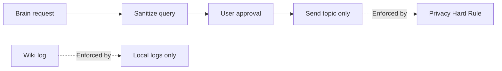

# Privacy

Hard rules for outbound MCP calls and log storage.

## Source Mapping

| Source | Reference |
|--------|-----------|
| mcp-server-layer.md | Section 7 (Privacy — Hard Rule) |
| mcp-server-layer-flow.mermaid | `PRIVACY` subgraph `PR1`–`PR3`; enforced on `G` and `LOG` |

## Responsibilities

All MCP server calls follow the **master privacy rule**:

- **Outbound calls carry topic only — never personal context** (`PR1`)
- All queries are **sanitized** before being sent to any MCP server
- Personal data never leaves the system through an MCP call **without explicit per-request user approval**
- **Approval is required for every call** regardless of data sensitivity (`PR2`)
- **Logs stored locally only — never sent externally** (`PR3`)

Enforcement points:

- `G` — Route to server; send sanitized query; topic only
- `LOG` — Wiki MCP log; sanitized fields only

## Inputs / Outputs

| Direction | Content |
|-----------|---------|
| **In** | Raw intent from brain pipeline |
| **Out** | Sanitized topic-only outbound payload |

## Flow

## Rules and Constraints

- No exceptions for verification pipeline MCP queries.
- Aligns with brain privacy ([specs/brain/privacy.md](../brain/privacy.md)) and tools privacy ([specs/tools/privacy.md](../tools/privacy.md)).

## Open Items

_None specific to this component._

## Cross-References

- [approval-model.md](approval-model.md)
- [logging.md](logging.md)
- [execution-flow.md](execution-flow.md)
