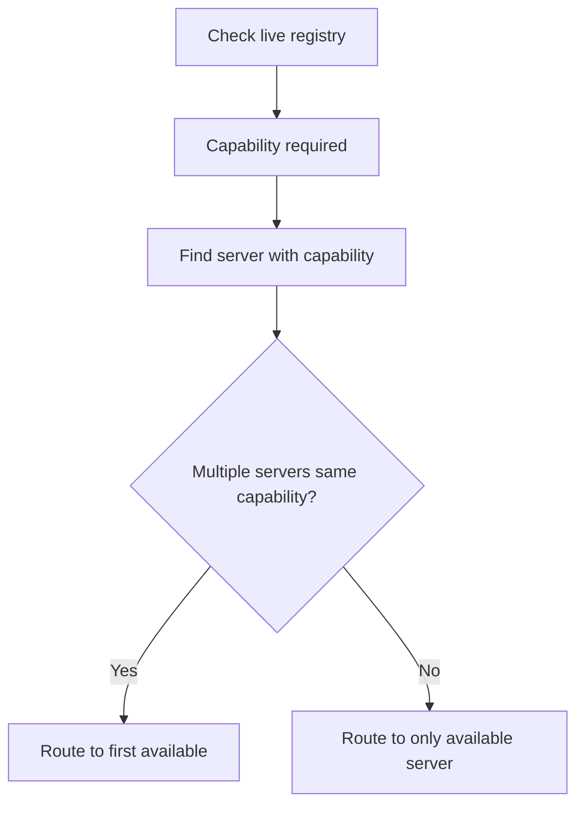

# Routing Logic

Automatic selection of the MCP server that provides a required capability.

## Source Mapping

| Source | Reference |
|--------|-----------|
| mcp-server-layer.md | Section 2.1 (Routing Logic) |
| mcp-server-layer-flow.mermaid | `ROUTING` subgraph `RT1`–`RT5`; linked from `C` |

## Responsibilities

- Each MCP server declares what capabilities it provides (e.g. web search, calendar, code execution).
- When a tool or verification call is needed, C.O.B.R.A. routes to the server that **declares that capability**.
- If **multiple servers** declare the same capability, C.O.B.R.A. routes to the **first available** one (`RT4`).
- If only one server declares the capability, route to that server (`RT5`).
- **Routing decisions are logged for every call** ([logging.md](logging.md)).

Mermaid routing subgraph:

1. `RT1` — Capability required identified by brain
2. `RT2` — Find server declaring that capability
3. `RT3` — Multiple servers declare same capability?
4. Yes → `RT4` Route to first available server
5. No → `RT5` Route to only available server

## Inputs / Outputs

| Direction | Content |
|-----------|---------|
| **In** | Required capability from brain/tools/verification pipeline |
| **In** | Live registry status ([live-registry.md](live-registry.md)) |
| **Out** | Selected server for approval and execution |

## Flow

## Rules and Constraints

- Routing uses registry availability — unavailable servers are skipped.
- No available server → [execution-flow.md](execution-flow.md) `UNAVAIL` path.

## Open Items

- [ ] Define behavior when two servers declare conflicting capabilities
- [ ] Define whether capability routing priority can be manually configured per server

## Cross-References

- [live-registry.md](live-registry.md)
- [execution-flow.md](execution-flow.md)
- [logging.md](logging.md)
- [config-structure.md](config-structure.md) — `capabilities` list per server
- [specs/brain/verification-pipeline.md](../brain/verification-pipeline.md)
