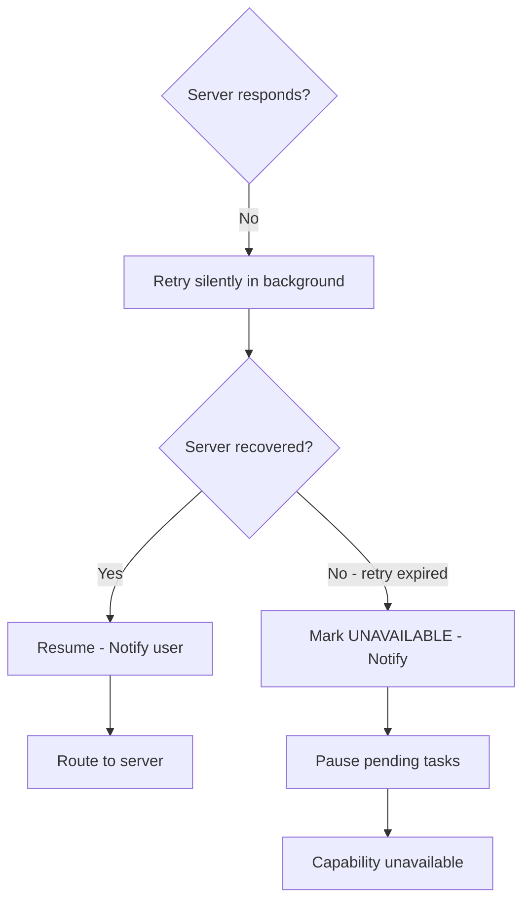

# Server Down Mid-Session

Recovery and degradation when an MCP server goes offline during an active session.

## Source Mapping

| Source | Reference |
|--------|-----------|
| mcp-server-layer.md | Section 5 (Server Down Mid-Session) |
| mcp-server-layer-flow.mermaid | `DOWN` subgraph `D1`–`D5`; `H` no-response branch; `D3` → `G`; `D5` → `UNAVAIL` |

## Responsibilities

If an MCP server goes offline during an active session:

1. C.O.B.R.A. **retries the connection silently in the background** (`D1`)
2. If the server recovers → **resumes normal operation**, notifies the user (`D3` → `G`)
3. If the server remains down after a **defined retry period** → notifies the user and marks the server **unavailable** (`D4`)
4. Any **pending tasks** requiring that server are **paused** and the user is informed (`D5`)
5. C.O.B.R.A. **continues operating normally** with remaining available servers

Mermaid `DOWN` flow:

- `D1` Retry silently in background
- `D2` Server recovered?
- Yes → `D3` Resume normal operation, notify user
- No (retry period expired) → `D4` Mark UNAVAILABLE, notify → `D5` Pause pending tasks

## Inputs / Outputs

| Direction | Content |
|-----------|---------|
| **In** | Failed response / timeout at `H` |
| **Out** | Registry status update; user notifications; paused task list |

## Flow

## Rules and Constraints

- One server's failure must not affect other connections ([multi-server-support.md](multi-server-support.md)).
- Retry period and max retries are **undefined** (open item).

## Open Items

- [ ] Define retry interval and maximum retry count before marking server unavailable
- [ ] Define what happens to a paused task when a server comes back online — auto-resume or require user to re-trigger

## Cross-References

- [live-registry.md](live-registry.md)
- [execution-flow.md](execution-flow.md)
- [multi-server-support.md](multi-server-support.md)
