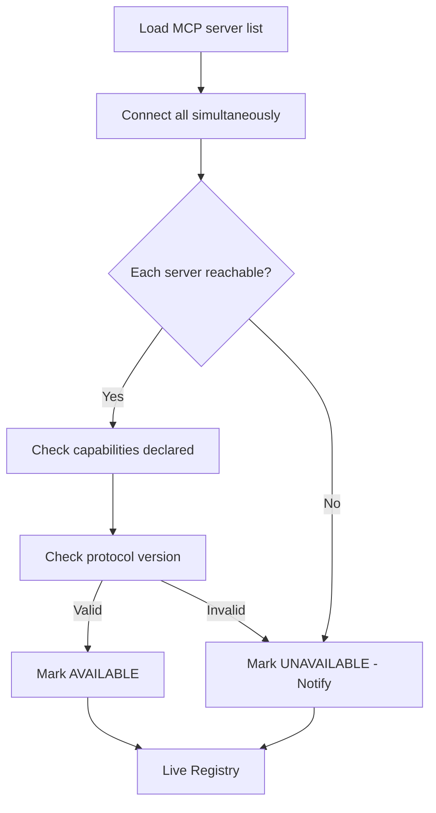

# Startup Validation

Pre-ready checks for every configured MCP server on C.O.B.R.A. startup.

## Source Mapping

| Source | Reference |
|--------|-----------|
| mcp-server-layer.md | Section 3 (Startup Validation) |
| mcp-server-layer-flow.mermaid | `STARTUP` subgraph `S1`–`S7`; `A` → `STARTUP` |

## Responsibilities

All configured MCP servers are validated on startup **before C.O.B.R.A. is ready**:

| Check | What it validates |
|---|---|
| Server reachable | Endpoint responds at configured URL |
| Capabilities declared | Server returns a valid capability list |
| Protocol version | Server MCP protocol version is compatible |

Flow per server (`S3`–`S5`):

1. `S1` — Load MCP server list from config
2. `S2` — Connect to all servers simultaneously
3. `S3` — Each server: reachable?
4. If yes → `S4` Check capabilities declared → `S5` Check protocol version compatible
5. Valid → `S6` Mark server AVAILABLE in live registry
6. Invalid / unreachable → `S7` Mark server UNAVAILABLE; notify user of failure

Post-validation:

- If a server fails validation, C.O.B.R.A. **reports which server failed and why**.
- C.O.B.R.A. **still starts** with the remaining valid servers.
- Failed servers are flagged unavailable in the live registry.
- User is notified of any validation failures at startup.

## Inputs / Outputs

| Direction | Content |
|-----------|---------|
| **In** | Server list from [discovery.md](discovery.md) / config |
| **Out** | Per-server pass/fail; registry population; user notifications |

## Flow

## Rules and Constraints

- Validation is mandatory on every startup for all configured servers.
- Partial success is acceptable — do not block start on single-server failure.

## Open Items

- [ ] Define MCP protocol version compatibility requirements

## Cross-References

- [discovery.md](discovery.md)
- [live-registry.md](live-registry.md)
- [multi-server-support.md](multi-server-support.md)
- [config-structure.md](config-structure.md)
