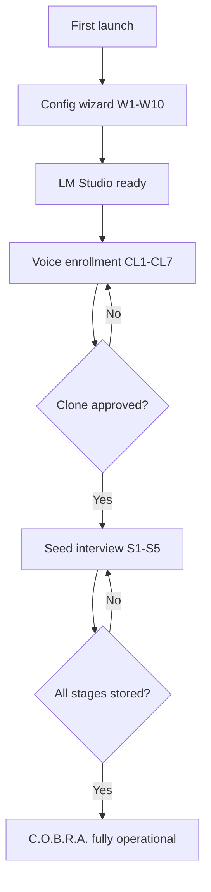

# First-Run Onboarding Sequence

Cross-component flow for voice enrollment and personality interview before C.O.B.R.A. is fully operational.

## Source Mapping

| Source | Reference |
|--------|-----------|
| specs/configuration/first-time-setup.md | W1–W10 config wizard |
| specs/voice/voice-cloning.md | CL1–CL7 voice enrollment |
| specs/seed-document/minimum-viable-seed.md | MV1–MV3 personality gate |
| specs/orchestrator/startup-phases.md | P1–P4 startup, post-READY onboarding |

## Responsibilities

On first launch (or until onboarding complete), C.O.B.R.A. runs a **sequenced onboarding shell** in the Chat UI:

| Step | Phase | Action | Gate |
|------|-------|--------|------|
| 1 | `config` | Config wizard W1–W10 | Config file written |
| 2 | `lm` | LM Studio reachable (may overlap with wizard) | V3 + V4 pass |
| 3 | `voice` | Guided voice enrollment CL1–CL7 | Clone approved (`model.ready` + user approval) |
| 4 | `seed` | Seed interview S1–S5 (one dimension per session) | All five stages stored |
| 5 | `complete` | Normal operation | Both gates pass |

**Hard gate:** Normal chat pipeline and cloned TTS are blocked until steps 3 and 4 complete. Progress persists across sessions in `~/.cobra/voice/` and `~/.cobra/memory/seed_state.json`.

**Order:** Voice enrollment runs **before** the seed personality interview.

## Inputs / Outputs

| Direction | Content |
|-----------|---------|
| **In** | User config, voice recordings, seed interview answers |
| **Out** | `onboarding_state.json`; WebSocket `onboarding.step` events; operational mode when complete |

## Flow

## Onboarding State

Persisted at `~/.cobra/onboarding_state.json`:

| Field | Type | Meaning |
|-------|------|---------|
| `phase` | `"config" \| "voice" \| "seed" \| "complete"` | Current onboarding step |
| `voice_enrollment_complete` | bool | Clone trained and user-approved |
| `personality_enrollment_complete` | bool | S1–S5 all stored |

On startup after READY, orchestrator reads state and routes input to the appropriate gate.

## WebSocket Events

| Event | Payload |
|-------|---------|
| `onboarding.step` | `{ phase, voice_complete, personality_complete, blocked_reason? }` |
| `onboarding.blocked` | `{ reason: string }` |

## Rules and Constraints

- Voice samples and models stay local-only ([specs/voice/privacy.md](../voice/privacy.md)).
- If Coqui/XTTS is unavailable, voice step shows actionable error — no silent stub pass.
- Seed interview requires LM Studio for reflect/summarize; voice step does not.
- When `needs_wizard=True`, Chat UI must start **before** LM Studio wait blocks startup ([specs/configuration/first-time-setup.md](../configuration/first-time-setup.md)).
- Config wizard W10 hands off to onboarding shell at `voice` phase — not directly to operational chat.

## Degraded Modes

| Condition | Behavior |
|-----------|----------|
| Coqui unavailable | Block at voice step with install instructions |
| LM Studio down during seed | Block at seed step; voice progress retained |
| Partial voice session | Resume from saved sample count and duration |
| Partial seed session | Resume from `seed_state.json` stage |

## Cross-References

- [specs/voice/voice-cloning.md](../voice/voice-cloning.md)
- [specs/seed-document/minimum-viable-seed.md](../seed-document/minimum-viable-seed.md)
- [specs/configuration/first-time-setup.md](../configuration/first-time-setup.md)
- [specs/orchestrator/startup-phases.md](../orchestrator/startup-phases.md)
